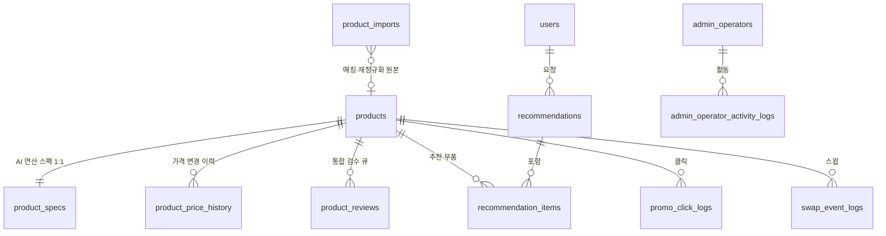

# 06. DB 설계 (ERD & 스키마)

**파일 경로:** `docs/06_db-erd.md`
**문서 버전:** Ver 3.0
**DBMS:** PostgreSQL (DB명 `popcorn_pc`)
**갱신일:** 2026-07-07
**선행 문서:** `12_data_normalization.md`, `13_standard_product_csv.md`, `07_api-spec.md`
**대체 선언:** 본 문서는 `06_db-erd.md` Ver 2.0 전체와 `12_data_normalization.md`의 §9(정규화 테이블 설계)·§18(최종 저장 기준)을 대체한다. 관련 결정 근거는 `docs/decisions/2026-07-07_product-data.md` 참조.

---

## 1. 설계 원칙

1. **레이어 분리로 "원본 보존"과 "표준 단일화"를 동시에 만족한다.** 원본 보존은 `product_imports`가, 표준 확정본은 `products`가 담당한다. 두 원칙을 한 테이블에 욱여넣지 않는다.
2. **`products`는 운영의 단일 진실(Single Source of Truth)이다.** 추천 엔진, 관리자 화면, 소싱 매칭이 모두 이 테이블만 바라본다. `product_category_normalized` 테이블은 폐기한다.
3. **재고 수량은 보유하지 않는다.** 재고 원장은 기존 쇼핑몰이다. 본 시스템은 상태값(판매중/품절/단종/삭제대기)만 동기화한다. 수량 보유는 이중 원장을 만든다.
4. **추천 후보 풀의 정의는 뷰 한 곳(`v_recommendation_candidates`)에만 존재한다.** 결정론 엔진, S1 후보 카운터, 스왑 대안 조회는 전부 이 뷰를 조회한다.
5. **회사 원장 필드와 공개 사실 필드를 구분한다.** 제품명·제품코드·매입가·판매가·상태는 회사만 아는 사실(CSV/실시간 업데이트로 관리), 소켓·TDP·치수·메모리 규격은 세상의 공개된 사실(AI 보강 파이프라인으로 관리)이다. §7 참조.

---

## 2. ERD 개요



---

## 3. 테이블 정의

### 3.1 product_imports — 원본 냉동 보관

CSV 업로드 원본 행을 JSONB로 통째 보존한다. 목적은 감사(audit)가 아니라 **재정규화 가능성**이다. 정규화 룰이 개선되면 이 테이블에서 다시 돌린다.

```sql
CREATE TABLE product_imports (
  import_id    BIGSERIAL PRIMARY KEY,
  job_id       BIGINT REFERENCES csv_import_jobs(job_id),
  product_code BIGINT,                -- 매칭된 상품 (없으면 NULL)
  raw_row      JSONB NOT NULL,        -- category1~4, spec_raw 포함 원본 행 전체
  imported_at  TIMESTAMP NOT NULL DEFAULT now()
);

CREATE INDEX idx_imports_product ON product_imports (product_code, imported_at DESC);
```

레거시 `category1~4`, `spec_raw`는 `products`에 컬럼으로 유지하지 않는다. 원본이 필요하면 이 테이블을 본다.

### 3.2 products — 표준 확정본 (단일 진실)

```sql
CREATE TABLE products (
  product_code        BIGINT PRIMARY KEY,          -- 자체상품코드
  product_name        VARCHAR(500) NOT NULL,
  maker               VARCHAR(100),
  brand               VARCHAR(100),
  model_name          VARCHAR(255),
  part_type           VARCHAR(50) NOT NULL,        -- 표준 부품 타입
  category_group      VARCHAR(50) NOT NULL,        -- core_part/peripheral/service/prebuilt_pc/internal/unknown
  status              VARCHAR(20) NOT NULL,        -- 판매중/품절/단종/삭제대기
  ai_candidate_yn     BOOLEAN NOT NULL DEFAULT false,
  review_required_yn  BOOLEAN NOT NULL DEFAULT false,

  purchase_price      BIGINT,                      -- 매입가 (회사 원장)
  sale_price          BIGINT,                      -- 판매가 (회사 원장)
  market_price        BIGINT,                      -- 시중가 (참고)

  locked_fields       JSONB NOT NULL DEFAULT '[]', -- 운영자 보정 잠금 (§4)
  supplier            VARCHAR(200),
  warranty_months     INTEGER,
  spec_source_text    TEXT,                        -- 원본 스펙 정제본
  created_at          TIMESTAMP NOT NULL DEFAULT now(),
  updated_at          TIMESTAMP NOT NULL DEFAULT now()
);

CREATE INDEX idx_products_candidate ON products (status, ai_candidate_yn, part_type);
CREATE INDEX idx_products_name_trgm ON products USING gin (product_name gin_trgm_ops);
```

기존 `margin_locked` 단일 플래그는 폐기하고 `locked_fields`로 대체한다.

### 3.3 product_specs — AI 연산 정형 필드 (1:1)

호환성 검증과 결정론 추천 엔진의 입력값. 와이드 테이블 유지(부품 타입별 개별 테이블·EAV 채택 안 함 — 조인 복잡도와 타입 안정성 사유).

```sql
CREATE TABLE product_specs (
  product_code    BIGINT PRIMARY KEY REFERENCES products(product_code),
  part_type       VARCHAR(50) NOT NULL,

  socket          VARCHAR(30),      -- CPU/MB
  chipset         VARCHAR(50),      -- MB/GPU
  mem_type        VARCHAR(10),      -- DDR4/DDR5
  capacity_gb     INTEGER,          -- RAM/SSD/HDD
  clock_mhz       INTEGER,          -- RAM
  tdp_watt        INTEGER,          -- CPU/GPU 소비전력
  rated_watt      INTEGER,          -- POWER 정격 출력
  required_power_watt INTEGER,      -- GPU 권장 파워
  length_mm       INTEGER,          -- GPU 길이
  gpu_max_mm      INTEGER,          -- CASE GPU 장착 한계
  cooler_height_mm INTEGER,         -- CASE 쿨러 한계 / 공랭 높이
  cooler_tdp      INTEGER,          -- 쿨러 대응 TDP
  pcie_gen        VARCHAR(20),
  form_factor     VARCHAR(50),      -- ATX/M-ATX/Mini-ITX
  interface       VARCHAR(50),      -- NVMe/SATA
  tag_white       BOOLEAN NOT NULL DEFAULT false,
  tag_rgb         BOOLEAN NOT NULL DEFAULT false,
  tag_silent      BOOLEAN NOT NULL DEFAULT false,

  extract_source  VARCHAR(20),      -- 'rule' / 'ai_text' / 'ai_knowledge' / 'manual'
  confidence      NUMERIC(4,2),     -- 자동 추출 신뢰도
  verified_yn     BOOLEAN NOT NULL DEFAULT false,  -- 확정 승격 여부 (§7.3)
  updated_at      TIMESTAMP NOT NULL DEFAULT now()
);
```

> `extract_source`는 필드 그룹 대표값이다. 필드별 출처 추적이 필요해지면 별도 메타 테이블로 승격한다(현 규모에서는 과설계로 판단, 보류).

### 3.4 product_price_history — 가격 변경 이력

```sql
CREATE TABLE product_price_history (
  history_id   BIGSERIAL PRIMARY KEY,
  product_code BIGINT NOT NULL REFERENCES products(product_code),
  field        VARCHAR(20) NOT NULL,   -- 'purchase' / 'sale' / 'market'
  old_price    BIGINT,
  new_price    BIGINT NOT NULL,
  reason       VARCHAR(30) NOT NULL,   -- 'csv' / 'sourcing' / 'margin_policy' / 'manual'
  ref_id       BIGINT,                 -- sourcing_id, job_id 등 근거 참조
  changed_by   BIGINT,                 -- 운영자 (시스템이면 NULL)
  changed_at   TIMESTAMP NOT NULL DEFAULT now()
);

CREATE INDEX idx_price_history_product ON product_price_history (product_code, changed_at DESC);
```

### 3.5 product_reviews — 통합 검수 큐

기존 `product_upload_reviews`를 확장 대체한다. CSV 오류 행, 저신뢰 추출, 교차검증 불일치, 소싱 매칭 보류를 한 큐로 받는다.

```sql
CREATE TABLE product_reviews (
  review_id     BIGSERIAL PRIMARY KEY,
  product_code  BIGINT REFERENCES products(product_code),
  review_type   VARCHAR(30) NOT NULL,  -- 'csv_error' / 'spec_missing' / 'spec_conflict' / 'low_confidence' / 'sourcing_hold'
  field_name    VARCHAR(50),           -- 대상 필드 (해당 시)
  detail        TEXT,                  -- 사유·비교값 (예: "원문 272mm vs 지식 251mm")
  review_status VARCHAR(30) NOT NULL DEFAULT '대기',  -- 대기/검수중/승인/수정/보류/제외
  reviewed_by   BIGINT,
  reviewed_at   TIMESTAMP,
  created_at    TIMESTAMP NOT NULL DEFAULT now()
);

CREATE INDEX idx_reviews_queue ON product_reviews (review_status, created_at);
```

### 3.6 v_recommendation_candidates — 추천 후보 뷰 (유일한 정의처)

```sql
CREATE VIEW v_recommendation_candidates AS
SELECT p.*, ps.*
FROM products p
JOIN product_specs ps USING (product_code)
WHERE p.status = '판매중'
  AND p.ai_candidate_yn = true
  AND p.review_required_yn = false
  AND p.category_group = 'core_part'
  AND p.part_type IN ('CPU','GPU','MB','RAM','SSD','HDD','POWER','CASE','COOLER_CPU_AIR','COOLER_CPU_AIO');
```

품절/단종 토글 → `products.status` 변경 → 뷰에서 즉시 제외(1초 룰 자동 충족). 후보 풀 캐시를 도입할 경우 상태 변경 시 캐시 무효화 훅을 함께 건다.

### 3.7 유지 테이블

`users`, `logs`, `recommendations`, `recommendation_items`, `policy_weights`, `category_margin_policies`, `api_cost_logs`, `promo_click_logs`, `swap_event_logs`, `rate_limit_policies`, `cost_thresholds`, `csv_import_jobs`, `csv_import_errors`, `admin_operators`, `admin_operator_activity_logs`, 제품 소싱 3종(`sourcing_batches`, `product_sourcing_quotes`, `product_sourcing_match_candidates`)은 Ver 2.0 정의를 유지한다.

---

## 4. 필드 소유권 & 덮어쓰기 규칙

### 4.1 소유권 매트릭스

| 필드 그룹 | 원장 | 갱신 경로 | 비고 |
|---|---|---|---|
| 제품코드·제품명·상태 | 회사(쇼핑몰) | CSV 업서트 / 실시간 API | 회사만 아는 사실 |
| 매입가·판매가·시중가 | 회사 | CSV / 소싱 확정 / 마진 정책 제안 승인 | §6 가격 흐름 |
| part_type·category_group | 정규화 파이프라인 | 룰 테이블 + 검수 | |
| 스펙 정형 필드(specs.*) | 공개 사실 | AI 보강 파이프라인(§7) + 운영자 검수 | |
| ai_candidate_yn·review_required_yn | 시스템 산출 | 파이프라인 자동 | |

### 4.2 덮어쓰기 우선순위

```text
운영자 수동(locked) > 소싱 확정 > CSV 업서트 > AI 보강 > 룰 추출
```

### 4.3 locked_fields 규칙

- 운영자가 편집 패널에서 필드를 수정·저장하면 해당 필드명이 `products.locked_fields`에 등록된다.
- `product_specs` 소속 필드는 `"specs."` 접두 네임스페이스로 표기한다. 예: `["specs.length_mm", "sale_price"]`
- **CSV 업서트와 AI 보강 파이프라인은 locked_fields에 등록된 필드를 건너뛴다.** 잠금 조회는 `products` 한 곳에서만 한다(두 테이블 분산 금지).
- 잠금 해제는 편집 패널에서 운영자가 명시적으로 수행한다.
- 잠금 등록·해제는 운영자 활동 로그 기록 대상이다.
- UI 반영: ADM-CSV-010 사전 검증 카드에 "잠긴 필드 N건 보호됨"을 표기한다.

---

## 5. 부품 타입별 필수 연산 필드 매트릭스

`review_required_yn` 판정과 호환성 엔진 입력의 기준. **필수 필드 중 하나라도 NULL이면 review_required_yn = true**이며 추천 풀에서 제외된다.

| part_type | 필수 필드 | 권장 필드 |
|---|---|---|
| CPU | socket, tdp_watt | — |
| GPU | length_mm, tdp_watt | required_power_watt, pcie_gen |
| MB | socket, chipset, mem_type, form_factor | — |
| RAM | mem_type, capacity_gb | clock_mhz |
| SSD/HDD | interface, capacity_gb | pcie_gen |
| POWER | rated_watt | — |
| CASE | gpu_max_mm, cooler_height_mm, form_factor | — |
| COOLER_CPU_AIR | cooler_tdp, cooler_height_mm | socket |
| COOLER_CPU_AIO | cooler_tdp | socket |

이 매트릭스는 호환성 검증 룰의 입력 필드와 1:1로 일치해야 하며, 검증 룰 변경 시 본 표를 함께 개정한다.

---

## 6. 가격 흐름 3원칙

1. **소싱 확정 매칭 시 매입가 갱신은 자동이 아니다.** 확정 모달에서 운영자가 "매입가 갱신" 여부를 선택한다. 갱신 시 `history(reason='sourcing', ref_id=sourcing_id)`.
2. **판매가 재계산은 제안 + 승인 방식이다.** 매입가 변경 시 시스템은 `카테고리 마진 정책 기준 권장 판매가`를 산출해 상품 마스터에 제안 배지로 노출한다. 운영자 승인 시에만 `sale_price` 반영, `history(reason='margin_policy')`. 자동 집행하지 않는다 — 가격 결정권은 운영자에게 있다.
   - UI 파급: ADM-DSH-010 대시보드에 "가격 검토 대기 N건" 미니 위젯 추가.
3. **모든 가격 변경은 `product_price_history`에 reason·ref_id와 함께 기록한다.** 근거 리포트("모든 견적에는 이유가 있습니다")의 가격 출처 추적 기반이다.

`sale_price`가 locked_fields에 등록된 상품은 제안 배지만 노출하고 CSV·정책에 의한 변경을 차단한다.

---

## 7. AI 스펙 보강 파이프라인

### 7.1 역할 경계

회사 원장 필드(§4.1)는 AI가 건드리지 않는다. AI 보강 대상은 **세상의 공개된 사실**인 스펙 정형 필드에 한정한다. AI는 채우는 노동을 담당하고, 신뢰는 교차검증 게이트가 만든다.

**LLM 역할 원칙 개정:** "LLM의 역할은 셋이다 — ① 입력 파서, ② 설명 생성기, ③ **오프라인 데이터 보강(검증 게이트 필수)**." 추천 시점의 부품 선택은 여전히 결정론 엔진만 수행한다. 본 파이프라인은 오프라인에서 결정론 엔진의 입력 데이터를 채우는 작업이므로 기존 아키텍처 원칙과 충돌하지 않는다.

### 7.2 4단계 처리

```text
1단계  룰 추출 (extract_source='rule')
       spec_source_text에서 정규식 룰 테이블로 추출. 결정론·무비용. 항상 최우선.

2단계  LLM 원문 추출 (extract_source='ai_text')
       룰이 못 뽑은 필드를 상품명 + spec_source_text에서 LLM이 추출.
       원문에 존재하지만 표기가 비정형인 경우 담당.

3단계  LLM 지식 보강 (extract_source='ai_knowledge')
       원문에 없는 필드를 LLM의 공개 스펙 지식으로 채움.
       모델명 기반 조회 (예: "이엠텍 RTX 4060 WHITE 8GB"의 공개 스펙).

4단계  교차검증 게이트
       2단계(원문)와 3단계(지식)가 독립적으로 산출한 값을 비교.
       - 일치        → verified_yn = true 자동 승격
       - 불일치      → product_reviews(type='spec_conflict', detail에 양측 값) 큐행
       - 한쪽만 존재 → confidence 기준 적용 (0.85 이상 반영·미검증, 미만 큐행)
```

### 7.3 호환성 치명 필드 게이트 (양보 불가 원칙)

`length_mm`, `gpu_max_mm`, `rated_watt`, `socket`은 **verified_yn = true가 되기 전까지 추천 풀 제외**를 유지한다. 근거: 동일 칩셋이라도 제조사 모델별 실측 치수가 크게 다르며(RTX 4060 기준 199~300mm), 이 필드의 오류는 "조립 불가 PC 미출고" 핵심 약속을 직접 깨뜨린다. AI 보강의 목적은 검수 폐지가 아니라 검수 대상을 "빈칸 전부 → 교차검증 불일치분"으로 축소하는 것이다.

### 7.4 검수 운영 규칙

- **검수 큐 기본 정렬은 추천 노출 빈도 내림차순.** 많이 팔리는 부품부터 verified를 채워 체감 커버리지를 최속으로 올린다.
- **"같은 모델 상품에 스펙 복제" 기능.** 동일 model_name의 타 상품코드에 검증 스펙을 복사(verified 유지). 모델 마스터 테이블은 MVP1에서 도입하지 않으며, 검수 부하가 실측 병목이 될 때 정식 승격을 재검토한다.
- 3단계 LLM 호출은 관리자 도메인의 비용 통제(Rate Limit → Cost Guard → Mock Mode) 게이트를 동일하게 거친다.

### 7.5 화면 파급

| 화면 | 변경 |
|---|---|
| ADM-PRD-020 (신규) | 통합 검수 큐 — 대기 목록, 승인/수정/제외, 노출 빈도순 정렬, 스펙 복제 버튼, 교차검증 비교 뷰 |
| ADM-PRD-010 | AI 필드 상태 배지에 verified 구분 추가, 잠금 필드 표시 |
| ADM-CSV-010 | 사전 검증 카드에 "잠긴 필드 N건 보호됨" |
| ADM-DSH-010 | "가격 검토 대기 N건" 미니 위젯 |

---

## 8. 상품 라이프사이클 (워크스루 요약)

| 단계 | 이벤트 | 주요 변경 |
|---|---|---|
| T0 | CSV 최초 업로드 | imports 냉동 + products INSERT + 동기 정규화·룰 추출 실행 |
| T1 | AI 추출 부분 실패 | specs 부분 채움, review_required=true, reviews 큐 등록 |
| T2 | 운영자 검수 보정 | specs 수동값 + verified, locked_fields 등록, review 해제 |
| T3 | CSV 재업로드 | imports 누적, 가격 갱신+history, 잠긴 필드 스킵 |
| T4 | 소싱 확정 매칭 | 매입가 갱신 선택 + history, 판매가 제안 배지 |
| T5 | 품절 토글 | status 변경 → 뷰에서 즉시 제외 (1초 룰) |

정규화·스펙 추출(1단계)은 **CSV 업서트 트랜잭션 내 동기 실행**한다(룰 기반·LLM 미호출·26,480행 규모 근거). LLM 보강(2~3단계)은 업서트 완료 후 비동기 잡으로 수행한다.

---

## 9. 폐기·대체 항목

| 항목 | 처리 |
|---|---|
| `product_category_normalized` 테이블 | 폐기. 분류 결과는 products 직접 보유, confidence/verified는 specs로 이동 |
| `products.category1~4`, `spec_raw` 컬럼 | 폐기. 원본은 product_imports.raw_row |
| `product_specs.margin_locked` | 폐기. products.locked_fields로 대체 |
| `product_upload_reviews` | product_reviews로 확장 대체 |
| 12번 문서 §9, §18 | 본 문서 §3, §4가 대체 |
| Ver 2.0 추천 후보 쿼리 | §3.6 뷰가 유일한 정의 |
