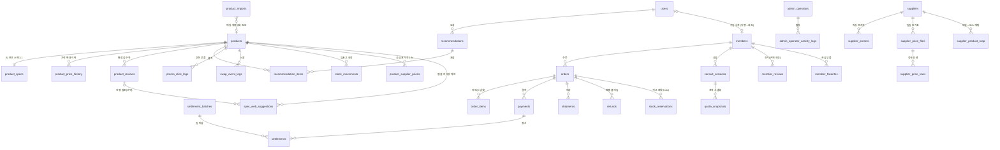

# 06. DB 설계 (ERD & 스키마)

**파일 경로:** `docs/06_db-erd.md`
**문서 버전:** Ver 4.0
**DBMS:** PostgreSQL (DB명 `popcorn_pc`) — 구성 위치: 구글 클라우드(기구성, 사용자 확인 2026-07-21). **실제 DB 생성·마이그레이션은 본 개정본 검토 후 별도 승인으로 착수한다.**
**갱신일:** 2026-07-21
**선행 문서:** `12_data_normalization.md`, `13_standard_product_csv.md`, `07_api-spec.md`, `docs/decisions/decision-log.md`(A-10·주변기기·가격 산정·단가표 결정), `docs/decisions/admin-identity.md`(ADM-PRC-040)
**대체 선언:** Ver 3.0의 상품 스파인(§1~§9)을 계승하되, **원칙 3(재고 수량 미보유)을 폐기**하고(A-10 커머스 승격) §10~§13(커머스 원장 · 공급처 단가표 · 상담·회원 활동 · 운영 설정)을 증분한다. Ver 2.0 대체 관계는 Ver 3.0 선언을 승계한다.
**검토 이력:** 1차 검토 2026-07-23 — 이슈 6건 발견·반영(users↔members 관계 정의, member_reviews 상태·S2 인용 필드, refunds 단계 어휘, products.supplier 폐기 예고, settlement_batches 신설, 매핑 요청 시각). 2차(DDL 작성 중, 같은 날) — ① `products.sku VARCHAR(20) UNIQUE` 추가(화면의 P-xxxx SKU는 product_code 자체상품번호와 별개 식별자), ② 후보 뷰 2종은 `SELECT p.*, ps.*`가 중복 컬럼으로 불가 → 명시 컬럼 + `ps.updated_at AS spec_updated_at`(실행본 `db/migrations/versions/0001_initial_schema.py` 기준). 3차 2026-07-23 — ADM-PRD-020 슬라이스: `product_reviews`에 origin_value·suggested_value·confidence 추가(마이그레이션 0002), §8 T2 해제·승격 조건 명문화. 검수 큐 정렬은 슬라이스 2에서 위험도순(치명>주의>경미) — 노출 빈도 데이터 확보 시 §7.4로 복귀. 4차 2026-07-24 — S4 주문 슬라이스: `orders`에 shipping_snap(배송지 스냅샷 저장처 부재 해소)·session_id(주문↔견적 링크) 추가(마이그레이션 0003).
**실행본:** `db/` — Alembic 마이그레이션(0001 = 본 문서 전체 DDL) + 시드. 스키마 변경은 본 문서 개정 → 새 마이그레이션 순서.

---

## 1. 설계 원칙

1. **레이어 분리로 "원본 보존"과 "표준 단일화"를 동시에 만족한다.** 원본 보존은 `product_imports`가, 표준 확정본은 `products`가 담당한다. 두 원칙을 한 테이블에 욱여넣지 않는다.
2. **`products`는 운영의 단일 진실(Single Source of Truth)이다.** 추천 엔진, 관리자 화면, 소싱 매칭이 모두 이 테이블만 바라본다. `product_category_normalized` 테이블은 폐기한다.
3. **[Ver 4.0 개정 — A-10] 재고 차감 단일 원장 = 본 시스템.** `products.stock_qty`를 보유하고 `stock_movements`가 입출고 원장이다. 쇼핑몰 판매분은 API 유입(`movement_type='mall_sale'`)으로 정합을 유지하고, 자체 결제 진행 중 재고는 `stock_reservations`(hold)로 예약한다. (Ver 3.0의 "수량 미보유·상태만 동기화" 원칙은 폐기 — §9 참조)
4. **추천 후보 풀의 정의는 뷰 한 곳(`v_recommendation_candidates`)에만 존재한다.** 결정론 엔진, S1 후보 카운터, 스왑 대안 조회는 전부 이 뷰를 조회한다.
5. **회사 원장 필드와 공개 사실 필드를 구분한다.** 제품명·제품코드·매입가·판매가·상태는 회사만 아는 사실(CSV/실시간 업데이트로 관리), 소켓·TDP·치수·메모리 규격은 세상의 공개된 사실(AI 보강 파이프라인으로 관리)이다. §7 참조.
6. **[Ver 4.0] 주문 원장은 운영 모드와 무관하게 항상 본 시스템에 생성한다.** 인계 모드는 복제 전달일 뿐이다(A-10 — 스냅샷 재현·감사 체계). 주문 라인은 생성 시점의 가격·사양을 스냅샷으로 보존한다.
7. **[Ver 4.0] 운영 설정은 버전 관리한다.** 운영 모드 스위치 5종·가격 산정 파라미터(카드수수료·마진)는 현행값 테이블 + 이력 테이블 쌍으로 관리하고, 모든 변경은 작업자·사유와 함께 기록한다.

---

## 2. ERD 개요


```mermaid
erDiagram
  product_imports }o--o| products : "매칭·재정규화 원본"
  products ||--|| product_specs : "AI 연산 스펙 1:1"
  products ||--o{ product_price_history : "가격 변경 이력"
  products ||--o{ product_reviews : "통합 검수 큐"
  products ||--o{ recommendation_items : "추천 부품"
  products ||--o{ promo_click_logs : "클릭"
  products ||--o{ swap_event_logs : "스왑"
  recommendations ||--o{ recommendation_items : "포함"
  users ||--o{ recommendations : "요청"
  admin_operators ||--o{ admin_operator_activity_logs : "활동"

  %% Ver 4.0 증분
  users |o--o| members : "가입 승격 (익명→회원)"
  members ||--o{ orders : "주문"
  settlement_batches ||--o{ settlements : "일 마감"
  orders ||--o{ order_items : "라인(스냅샷)"
  orders ||--o{ payments : "결제"
  orders ||--o{ shipments : "배송"
  orders ||--o{ refunds : "환불·클레임"
  payments ||--o{ settlements : "정산"
  orders ||--o{ stock_reservations : "재고 예약(hold)"
  products ||--o{ stock_movements : "입출고 원장"
  suppliers ||--o{ supplier_presets : "파싱 프리셋"
  suppliers ||--o{ supplier_price_files : "일일 단가표"
  supplier_price_files ||--o{ supplier_price_rows : "정규화 행"
  suppliers ||--o{ supplier_product_map : "모델↔SKU 매핑"
  products ||--o{ product_supplier_prices : "공급처 가격 1:N"
  members ||--o{ consult_sessions : "상담"
  consult_sessions ||--o{ quote_snapshots : "견적 스냅샷"
  members ||--o{ member_reviews : "후기(구매 인증)"
  members ||--o{ member_favorites : "관심 부품"

  %% 9차 개정 (2026-08-13) — 웹 검색 사양 채움
  products ||--o{ spec_web_suggestions : "웹 검색 사양 제안"
  product_reviews |o--o{ spec_web_suggestions : "반영 참조(선택)"
```

---

## 3. 테이블 정의

### 3.1 product_imports — 원본 냉동 보관

CSV 업로드 원본 행을 JSONB로 통째 보존한다. 목적은 감사(audit)가 아니라 **재정규화 가능성**이다. 정규화 룰이 개선되면 이 테이블에서 다시 돌린다.

```sql
CREATE TABLE product_imports (
  import_id    BIGSERIAL PRIMARY KEY,
  job_id       BIGINT REFERENCES csv_import_jobs(job_id),
  product_code BIGINT,                -- 매칭된 상품 (없으면 NULL)
  raw_row      JSONB NOT NULL,        -- category1~4, spec_raw 포함 원본 행 전체
  imported_at  TIMESTAMP NOT NULL DEFAULT now()
);

CREATE INDEX idx_imports_product ON product_imports (product_code, imported_at DESC);
```

레거시 `category1~4`, `spec_raw`는 `products`에 컬럼으로 유지하지 않는다. 원본이 필요하면 이 테이블을 본다.

### 3.2 products — 표준 확정본 (단일 진실)

```sql
CREATE TABLE products (
  product_code        BIGINT PRIMARY KEY,          -- 자체상품번호 (예: 20481001)
  sku                 VARCHAR(20) UNIQUE,          -- [2차 검토] 화면 표기 SKU (예: P-1001) — product_code와 별개 식별자
  product_name        VARCHAR(500) NOT NULL,
  maker               VARCHAR(100),
  brand               VARCHAR(100),
  model_name          VARCHAR(255),
  part_type           VARCHAR(50) NOT NULL,        -- 표준 부품 타입
  category_group      VARCHAR(50) NOT NULL,        -- core_part/peripheral/service/prebuilt_pc/internal/unknown
  status              VARCHAR(20) NOT NULL,        -- 판매중/품절/단종/삭제대기
  ai_candidate_yn     BOOLEAN NOT NULL DEFAULT false,
  review_required_yn  BOOLEAN NOT NULL DEFAULT false,

  purchase_price      BIGINT,                      -- 매입가 (회사 원장)
  sale_price          BIGINT,                      -- 판매가 (회사 원장)
  market_price        BIGINT,                      -- 시중가 (참고)

  locked_fields       JSONB NOT NULL DEFAULT '[]', -- 운영자 보정 잠금 (§4)
  supplier            VARCHAR(200),                -- [검토: 폐기 예정] §11.4 product_supplier_prices(1:N)로 대체 — 마이그레이션 시 제거 여부 확정
  warranty_months     INTEGER,
  spec_source_text    TEXT,                        -- 원본 스펙 정제본

  -- [Ver 4.0 추가]
  danawa_code         VARCHAR(20),                 -- 다나와 상품코드 — 거래처 간 교차 매칭 키 (§11)
  stock_qty           INTEGER NOT NULL DEFAULT 0,  -- 재고 수량 — 단일 원장 (A-10, 원칙 3)
  safety_stock        INTEGER,                     -- [5차 개정] 안전재고 기준 — 이 수량 미달 시
                                                   --   매입 견적(ADM-SRC-010) 자동 등록·입고 대기 합류.
                                                   --   NULL = 기준 미설정(미달 판정 대상 아님).
                                                   --   확정 근거: 사용자 확정 2026-07-14 "안전재고 개념 유지"

  created_at          TIMESTAMP NOT NULL DEFAULT now(),
  updated_at          TIMESTAMP NOT NULL DEFAULT now()
);

CREATE INDEX idx_products_candidate ON products (status, ai_candidate_yn, part_type);
CREATE INDEX idx_products_name_trgm ON products USING gin (product_name gin_trgm_ops);
CREATE UNIQUE INDEX idx_products_danawa ON products (danawa_code) WHERE danawa_code IS NOT NULL;  -- [Ver 4.0]
```

기존 `margin_locked` 단일 플래그는 폐기하고 `locked_fields`로 대체한다.

### 3.3 product_specs — AI 연산 정형 필드 (1:1)

호환성 검증과 결정론 추천 엔진의 입력값. 와이드 테이블 유지(부품 타입별 개별 테이블·EAV 채택 안 함 — 조인 복잡도와 타입 안정성 사유).

```sql
CREATE TABLE product_specs (
  product_code    BIGINT PRIMARY KEY REFERENCES products(product_code),
  part_type       VARCHAR(50) NOT NULL,

  socket          VARCHAR(30),      -- CPU/MB
  chipset         VARCHAR(50),      -- MB/GPU
  mem_type        VARCHAR(10),      -- DDR4/DDR5
  capacity_gb     INTEGER,          -- RAM/SSD/HDD
  clock_mhz       INTEGER,          -- RAM
  tdp_watt        INTEGER,          -- CPU/GPU 소비전력
  rated_watt      INTEGER,          -- POWER 정격 출력
  required_power_watt INTEGER,      -- GPU 권장 파워
  length_mm       INTEGER,          -- GPU 길이
  gpu_max_mm      INTEGER,          -- CASE GPU 장착 한계
  cooler_height_mm INTEGER,         -- CASE 쿨러 한계 / 공랭 높이
  cooler_tdp      INTEGER,          -- 쿨러 대응 TDP
  pcie_gen        VARCHAR(20),
  form_factor     VARCHAR(50),      -- ATX/M-ATX/Mini-ITX
  interface       VARCHAR(50),      -- NVMe/SATA
  tag_white       BOOLEAN NOT NULL DEFAULT false,
  tag_rgb         BOOLEAN NOT NULL DEFAULT false,
  tag_silent      BOOLEAN NOT NULL DEFAULT false,

  -- [Ver 4.0] 주변기기 사양 (와이드 테이블 기조 유지 — EAV 채택 안 함)
  size_inch       NUMERIC(4,1),     -- MONITOR 화면 크기
  resolution      VARCHAR(20),      -- MONITOR: FHD/QHD/UHD…
  refresh_hz      INTEGER,          -- MONITOR 주사율 — 함께 구성 GPU 매칭 근거
  panel           VARCHAR(20),      -- MONITOR: IPS/VA/OLED…
  ports           JSONB,            -- MONITOR 출력 포트 예: {"dp":1,"hdmi":2}
  switch_type     VARCHAR(30),      -- KEYBOARD 스위치
  key_layout      VARCHAR(20),      -- KEYBOARD 배열(풀/텐키리스…)
  connection      VARCHAR(20),      -- KEYBOARD/MOUSE/HEADSET: 유선/무선/블루투스

  extract_source  VARCHAR(20),      -- 'rule' / 'ai_text' / 'ai_knowledge' / 'manual'
  confidence      NUMERIC(4,2),     -- 자동 추출 신뢰도
  verified_yn     BOOLEAN NOT NULL DEFAULT false,  -- 확정 승격 여부 (§7.3)
  updated_at      TIMESTAMP NOT NULL DEFAULT now()
);
```

> `extract_source`는 필드 그룹 대표값이다. 필드별 출처 추적이 필요해지면 별도 메타 테이블로 승격한다(현 규모에서는 과설계로 판단, 보류).

### 3.4 product_price_history — 가격 변경 이력

```sql
CREATE TABLE product_price_history (
  history_id   BIGSERIAL PRIMARY KEY,
  product_code BIGINT NOT NULL REFERENCES products(product_code),
  field        VARCHAR(20) NOT NULL,   -- 'purchase' / 'sale' / 'market'
  old_price    BIGINT,
  new_price    BIGINT,                 -- [2026-08-15 개정] NOT NULL 해제(마이그레이션 0050).
                                       --   값을 "비움"도 가격 변경이다 — PATCH가 판매가·매입가를
                                       --   빈 문자열로 지울 때(products.{field} -> NULL) 이 표가
                                       --   NOT NULL이라 그 변경을 기록할 수 없었다(원장 공백).
                                       --   확인자 실측(2026-08-15, 데모 상품 93720): PATCH
                                       --   sale_price="" -> changed:1 성공 응답 + products.
                                       --   sale_price NULL, 그런데 이력 행은 0개 — §6 원칙 3
                                       --   ("모든 가격 변경을 기록한다")이 깨진 사례였다.
                                       --   new_price가 NULL이면 "그 시점부터 값이 없다"는
                                       --   뜻이지 "기록을 안 했다"는 뜻이 아니다.
  reason       VARCHAR(30) NOT NULL,   -- 'csv' / 'sourcing' / 'margin_policy' / 'manual' / 'price_import'(+_undo)
  ref_id       BIGINT,                 -- sourcing_id, job_id, file_id, 활동로그 log_id (사유별 의미 상이)
  supplier_id  BIGINT REFERENCES suppliers(supplier_id),
                                       -- [5차 개정] 매입가 이력의 출처 공급처.
                                       --   field='purchase'일 때만 채운다(판매가는 공급처 무관 → NULL).
                                       --   purchase_price 자체는 공급처 간 재판정 결과(최저가)이지만,
                                       --   그 값을 만든 공급처를 남겨 ADM-PRC-030에서 공급처별 추이를 그린다.
  changed_by   BIGINT,                 -- 운영자 (시스템이면 NULL)
  changed_at   TIMESTAMP NOT NULL DEFAULT now()
);

CREATE INDEX idx_price_history_product ON product_price_history (product_code, changed_at DESC);
```

### 3.5 product_reviews — 통합 검수 큐

기존 `product_upload_reviews`를 확장 대체한다. CSV 오류 행, 저신뢰 추출, 교차검증 불일치, 소싱 매칭 보류를 한 큐로 받는다.

```sql
CREATE TABLE product_reviews (
  review_id     BIGSERIAL PRIMARY KEY,
  product_code  BIGINT REFERENCES products(product_code),
  review_type   VARCHAR(30) NOT NULL,  -- 'csv_error' / 'spec_missing' / 'spec_conflict' / 'low_confidence' / 'sourcing_hold'
  field_name    VARCHAR(50),           -- 대상 필드 (해당 시)
  detail        TEXT,                  -- 사유·비교값 (예: "원문 272mm vs 지식 251mm")
  origin_value    VARCHAR(255),        -- 원문 추출값 (0002 추가 — 캐스팅 가능한 정규값만: '272', 'DDR5'. 단위 표기 금지)
  suggested_value VARCHAR(255),        -- AI 지식 대조값 (0002 추가 — 동일 규약)
  confidence      NUMERIC(4,2),        -- 필드 단위 신뢰도 (0002 추가)
  review_status VARCHAR(30) NOT NULL DEFAULT '대기',  -- 대기/검수중/승인/수정/보류/제외
  reviewed_by   BIGINT,
  reviewed_at   TIMESTAMP,
  created_at    TIMESTAMP NOT NULL DEFAULT now()
);

CREATE INDEX idx_reviews_queue ON product_reviews (review_status, created_at);
```

값 컬럼 3종(0002)은 교차검증 게이트(§7.2) 산출값의 1급 승격 — 검수 확정 액션의 기계 판독 입력이다. `specs.confidence`(행 대표값)와 입도가 다르다(큐행 = 필드 단위). **검수 대상 필드는 확정 전 `product_specs`에서 NULL을 유지**하고(§7.2 "반영하지 않고 큐행"), 값은 큐행의 origin/suggested에만 존재하며 확정 액션이 비로소 specs에 쓴다.

### 3.6 v_recommendation_candidates — 추천 후보 뷰 (유일한 정의처)

```sql
CREATE VIEW v_recommendation_candidates AS
SELECT p.*, ps.*
FROM products p
JOIN product_specs ps USING (product_code)
WHERE p.status = '판매중'
  AND p.ai_candidate_yn = true
  AND p.review_required_yn = false
  AND p.category_group = 'core_part'
  AND p.part_type IN ('CPU','GPU','MB','RAM','SSD','HDD','POWER','CASE','COOLER_CPU_AIR','COOLER_CPU_AIO');
```

품절/단종 토글 → `products.status` 변경 → 뷰에서 즉시 제외(1초 룰 자동 충족). 후보 풀 캐시를 도입할 경우 상태 변경 시 캐시 무효화 훅을 함께 건다.

**[Ver 4.0] v_companion_candidates — 함께 구성(주변기기) 후보 뷰.** 본체 엔진과 분리된 제안 풀. 엔진 검증 대상이 아니라 권장 매칭 근거(주사율↔GPU·포트)로만 쓰인다(주변기기 결정 2026-07-21).

```sql
CREATE VIEW v_companion_candidates AS
SELECT p.*, ps.*
FROM products p
JOIN product_specs ps USING (product_code)
WHERE p.status = '판매중'
  AND p.review_required_yn = false
  AND p.category_group = 'peripheral'
  AND p.part_type IN ('MONITOR','KEYBOARD','MOUSE','HEADSET','SPEAKER','WEBCAM');
```

### 3.7 [5차 개정] compat_rules — 조립 호환 규칙 (엔진의 단일 원천)

추천 엔진의 슬롯 진입 검사를 **데이터로 표현**한다. 그동안 규칙은 코드 상수(`recommend._slot_ok`)로만
존재했고 화면(ADM-ENG-010)은 그것을 읽어 표시했다 — 이제 **엔진이 이 테이블을 읽는다**.
테이블만 만들고 코드가 계속 상수를 쓰면 이중 원천이 되므로, 이 개정은 엔진 리팩터링과 함께 적용한다.

```sql
CREATE TABLE compat_rules (
  rule_id     BIGSERIAL PRIMARY KEY,
  rule_key    VARCHAR(40) NOT NULL UNIQUE,  -- socket / mem / gpu_len / cooler_socket …
  slot        VARCHAR(20) NOT NULL,         -- 검사 대상 슬롯 (SLOTS 어휘)
  field       VARCHAR(40) NOT NULL,         -- product_specs 컬럼
  op          VARCHAR(4)  NOT NULL,         -- eq / gte / lte
  ref_slot    VARCHAR(20) NOT NULL,         -- 비교 상대 슬롯 — **탐색 순서상 앞이어야 한다**
  ref_field   VARCHAR(40) NOT NULL,
  label       VARCHAR(100) NOT NULL,        -- 화면 표시명
  detail_fmt  VARCHAR(200),                 -- 표시 문구 템플릿 ({v}=대상값, {r}=상대값)
  blocking    BOOLEAN NOT NULL DEFAULT true,-- false면 경고만(현재 전부 true)
  active      BOOLEAN NOT NULL DEFAULT true,
  sort_order  INTEGER NOT NULL DEFAULT 0,
  updated_at  TIMESTAMP NOT NULL DEFAULT now()
);
```

**계약**: ① NULL 필드는 **불통과**(값을 모르는 부품을 호환으로 판정하지 않는다 — 신뢰 판매자 원칙)
② `ref_slot`은 슬롯 탐색 순서(CPU→MB→RAM→GPU→CASE→COOLER→POWER→SSD)에서 `slot`보다 앞이어야
하며, 위반 규칙은 로드 시 **건너뛰고 경고**한다(잘못된 규칙이 엔진을 죽이지 않게) ③ `active=false`
규칙은 로드하지 않는다 ④ 규칙 변경은 견적 결과를 바꾸므로 회귀 검증 대상이다(버전 발행은 이관).

### 3.8 유지 테이블

`users`, `logs`, `recommendations`, `recommendation_items`, `policy_weights`, `category_margin_policies`, `api_cost_logs`, `promo_click_logs`, `swap_event_logs`, `rate_limit_policies`, `cost_thresholds`, `csv_import_jobs`, `csv_import_errors`, `admin_operators`, `admin_operator_activity_logs`, `product_sourcing_match_candidates`는 Ver 2.0 정의를 유지한다.

### 3.9 [5차 개정] 관리자 인증 — admin_operators 확장 / admin_sessions (사용자 확정 2026-07-26)

**설계 원칙: 비밀번호를 저장하지 않는다.** 신원은 소셜 제공자(구글)가 확인하고, 우리는 **승인 여부와
권한만** 관리한다. 우리가 갖지 않은 정보는 유출될 수 없다 — 커머스 개인정보를 다루는 시스템의
공격면을 줄이는 선택이다. 자체 비밀번호를 추가하면 이 이득이 사라지므로 **추가하지 않는다**.

**흐름**: 소셜 로그인 → 계정 없으면 `status='대기'`로 신청 생성(프로필) → **승인 전에는 어떤 데이터도
보이지 않는다** → owner가 승인 + 권한 부여 → 세션 발급. 퇴사·사고 시 `status='정지'`(세션 즉시 무효).

```sql
ALTER TABLE admin_operators
  ADD COLUMN provider     VARCHAR(20),    -- google (dev 어댑터: 'dev')
  ADD COLUMN provider_uid VARCHAR(120),   -- 제공자 고유 ID — 이메일 변경에도 불변
  ADD COLUMN phone        VARCHAR(30),    -- 신청 시 프로필
  ADD COLUMN duty         VARCHAR(100),   -- 담당 업무
  ADD COLUMN approved_by  BIGINT REFERENCES admin_operators(operator_id),
  ADD COLUMN approved_at  TIMESTAMP,
  ADD COLUMN last_login_at TIMESTAMP;
-- status 어휘 확장: 대기 / 활성 / 정지   (기존 'active'는 '활성'으로 이행)
-- role 어휘(확정 2026-07-14): viewer(조회) / operator(운영자) / owner(관리자)

CREATE TABLE admin_sessions (
  session_id  VARCHAR(64) PRIMARY KEY,     -- 랜덤 32바이트 hex (예측 불가)
  operator_id BIGINT NOT NULL REFERENCES admin_operators(operator_id),
  created_at  TIMESTAMP NOT NULL DEFAULT now(),
  last_seen_at TIMESTAMP NOT NULL DEFAULT now(),
  expires_at  TIMESTAMP NOT NULL,          -- 절대 만료(8시간)
  revoked_at  TIMESTAMP,                   -- 로그아웃·정지 — **삭제하지 않는다**(감사)
  user_agent  VARCHAR(300)
);
```

**계약**: ① 쿠키는 `HttpOnly`+`SameSite=Lax`(+운영 `Secure`) — 토큰을 JS가 만지지 않아 XSS로
탈취 불가 ② 유휴 30분·절대 8시간 초과 시 무효 ③ **권한 게이트**: `/api/admin/*`는 GET=viewer 이상,
쓰기=operator 이상, 운영자 관리·정책 발행=owner ④ **작업 기록 주체가 세션 운영자로 바뀐다**
(그동안 operator_id=1 고정이라 "누가 했는지"를 남기지 못했다 — 감사 로그가 실제로 성립하는 지점)
⑤ 첫 관리자는 `.env` 부트스트랩 이메일 1개만 첫 로그인 시 자동 owner(그 뒤는 화면 승인만)
⑥ **만료·유휴 판정은 전부 DB의 `now()`로 한다** — 애플리케이션 로컬시각(KST)과 DB 시각(UTC)을
비교하면 방금 만든 세션도 만료로 오판된다(구현 중 실제로 겪은 함정).

### 3.10 [5차 개정] 매입 견적 — sourcing_batches / product_sourcing_quotes (A-10 정합)

Ver 2.0 정의(`vendor VARCHAR`)를 **공급처 원장과 연결**(`supplier_id` FK)하고 상태 어휘를 성문화한다.
"재고 소진·안전재고 미달 자동 등록"(ADM-SRC-010)의 **대기 목록은 저장하지 않고 파생**한다 —
`products.safety_stock`(0004)으로 판정 가능하므로 별도 큐 테이블을 두면 동기화 문제만 생긴다.
저장하는 것은 **운영자가 실제로 한 행위**(견적 요청·회신 기록·확정)뿐이다.

```sql
ALTER TABLE product_sourcing_quotes
  ADD COLUMN supplier_id BIGINT REFERENCES suppliers(supplier_id),
  ADD COLUMN replied_at  TIMESTAMP,      -- 회신 기록 시각 (NULL = 회신 대기)
  ADD COLUMN memo        VARCHAR(200);   -- 회신 조건(납기·수량 등) 자유 기록
-- status 어휘: 요청 / 회신 / 확정 / 취소
```

**흐름 계약**: 대기(파생) → **[견적 요청]** 공급처별 quote 행 생성(status='요청') →
**[회신 기록]** 운영자가 회신가를 대행 입력(status='회신'·replied_at) — 공급처 회신은 전화·메일로
오므로 **자동 수신이 아니라 대행 입력이 실제 업무**다(정직) → **[이 가격으로 확정]** 최저가 채택 →
`product_supplier_prices` 갱신 + `_reprice`(가격 이력 reason='sourcing'·supplier_id) +
같은 batch의 다른 quote는 '취소' → 재고는 **입고 화면(ADM-SRC-020)에서 실제 입고 시** 증가한다
(확정은 가격 결정일 뿐 수량이 들어온 사건이 아니다 — T10과의 경계).

### 3.11 [6차 개정] 고객 인증 — members 확장 / member_sessions (2026-07-26, 슬라이스 38)

**닫는 구멍**: `/api/my/*`가 `?email=` 하나로 아무나 남의 주문·결제·후기를 내주고 있었다.
회원 경계는 이제 **세션이 정한다** — 요청이 주장하는 이메일이 아니라.

관리자 인증(§3.9)과 **의도적으로 다른 3가지** — 지키는 대상이 다르다:

| | 관리자 | 고객 |
|---|---|---|
| 승인 게이트 | owner 승인 필요 | **없음** — 첫 로그인이 가입 |
| 만료 | 절대 8시간 · 유휴 30분 | **절대 14일 · 유휴 없음** |
| 권한 등급 | viewer/operator/owner | **없음** — 경계는 member_id |

같은 원칙: **비밀번호를 저장하지 않는다.** `joined_via`가 이미 email/kakao/naver를 갖고 있어
`provider` 컬럼은 만들지 않고 재사용한다(원천을 둘로 나누지 않는다).

```sql
ALTER TABLE members
  ADD COLUMN provider_uid  VARCHAR(120),   -- 제공자 고유 ID — 이메일 변경에도 불변
  ADD COLUMN last_login_at TIMESTAMP;
CREATE UNIQUE INDEX idx_members_provider ON members (joined_via, provider_uid)
  WHERE provider_uid IS NOT NULL;

CREATE TABLE member_sessions (             -- 구조는 admin_sessions와 동일(정책만 다름)
  session_id VARCHAR(64) PRIMARY KEY, member_id BIGINT NOT NULL REFERENCES members(member_id),
  created_at TIMESTAMP NOT NULL DEFAULT now(), last_seen_at TIMESTAMP NOT NULL DEFAULT now(),
  expires_at TIMESTAMP NOT NULL, revoked_at TIMESTAMP, user_agent VARCHAR(300)
);
```

**계약**: ① 쿠키 `popcorn_member_session`(HttpOnly·SameSite=Lax) ② 만료·철회 판정은 DB `now()`
③ **게스트는 그대로 열려 있다** — 상담·추천·주문 생성은 로그인을 요구하지 않는다("견적을 보려고
가입을 강요하지 않는다"는 A-10 결정을 인증이 뒤집지 않는다) ④ 주문 귀속: **세션이 있으면 세션 회원**,
없으면 게스트 주문(email upsert 유지 — 그 이메일은 자기신고값이며, 같은 이메일로 로그인해야
MY에서 보인다) ⑤ 탈퇴·정지 회원(`status != 'active'`)의 세션은 즉시 무효.

### 3.12 [7차 개정] 카탈로그 적재(T0) — 데모/실데이터 구분 · 다중 소켓 · 사양 출처 (2026-07-26, 슬라이스 39)

실파일 실측(마스터 24,303행 · 사양 EAV 339,650행 · 키 724종)에서 나온 개정이다.

**원천의 형태**: 사양이 **EAV(키-값)** 로 오는데 우리 `product_specs`는 컬럼형이다. 게다가
EAV 값의 60%(203,467행)가 `특성` 키에 값만 들어 있어(소켓·DDR·폼팩터·용량) **키가 아니라
값 패턴**으로 뽑아야 한다. 그래서 추출은 3계층이다:
`① EAV 키 직결 → ② 특성 값 패턴 → ③ 상품명 유도`. 그리고 GPU 권장파워만 ④ 참조표.

```sql
ALTER TABLE products       ADD COLUMN data_origin VARCHAR(10) NOT NULL DEFAULT 'real';
ALTER TABLE members        ADD COLUMN data_origin VARCHAR(10) NOT NULL DEFAULT 'real';
ALTER TABLE orders         ADD COLUMN data_origin VARCHAR(10) NOT NULL DEFAULT 'real';
ALTER TABLE csv_import_jobs ADD COLUMN data_origin VARCHAR(10) NOT NULL DEFAULT 'real',
                            ADD COLUMN row_review INTEGER NOT NULL DEFAULT 0,
                            ADD COLUMN source VARCHAR(40);
ALTER TABLE product_specs  ADD COLUMN socket_list  JSONB,   -- 쿨러 다중 소켓
                            ADD COLUMN spec_sources JSONB;   -- 필드 → eav|feature|name|reference
ALTER TABLE compat_rules   ALTER COLUMN op TYPE VARCHAR(12); -- 'contains' 수용
CREATE TABLE gpu_power_reference (chipset_key PK, recommended_watt, confirmed_yn, source_note, …);
```

**계약 5항**

① **데모/실데이터 구분**(사용자 지시 2026-07-26): 직원 베타에서 실운영 데이터가 쌓이면 시드
데모와 섞여 분리할 수 없다. `data_origin`('real'|'demo')을 원장 3곳에 두고, 기존 시드는
전부 'demo'로 이행했다. 적재 스크립트가 `--origin`으로 받으므로 **앞으로도 데모를 올려
테스트**할 수 있다.

② **쿨러는 소켓을 여러 개 지원한다**(실측: 6개 지원 180건·5개 73건·7개 43건). 단일값
`socket`으로는 표현이 불가능해 `socket_list JSONB` + `op='contains'` 규칙으로 바꿨다.
호환 규칙 `COOLER.socket_list contains CPU.socket`. **NULL·빈 배열은 불통과**(기존 원칙 유지).

③ **필드별 출처를 남긴다**(`spec_sources`). GPU 권장파워는 원천에 **391건 중 9건뿐**이라
칩셋 표준표로 채우는데(사용자 결정), 행 단위 `extract_source`로는 "이 필드만 참조값"을 말할
수 없다. 근거 카드는 `reference` 출처를 **'표준 권장값(확인 대기)'** 으로 구분 표시해야 한다 —
원천값과 같은 얼굴로 보이면 "근거가 사실"이라는 정체성이 깨진다.

④ **재고 수량은 원천에 없다**(상태값 판매중 7,860 / 품절 16,443만). 사용자 결정: 판매중 →
`stock_qty=1`, 품절 → 0. **수량은 실사 전까지 사실이 아니다** — 입고 화면(ADM-SRC-020)에서
채운다. 화면은 이 한계를 표기한다.

### 3.13 [8차 개정] 케이스 보드 규격 — form_factor_list · 호환 규칙 8종 (2026-07-26, 슬라이스 43)

**해소한 모순**: `CASE.form_factor`가 **필수 사양인데 호환 규칙이 쓰지 않았다.** 규칙이 쓰지
않는 필드를 게이트로 요구하면 근거 없이 추천을 막는다. 사용자 결정(선택 ②) = **규칙을
추가한다** — "보드가 케이스에 들어가는가"는 조립에 실제로 필요한 검증이기 때문이다.

**단일값으로 표현 불가**: 케이스는 규격을 여러 개 수용한다(실측 2,326건 중 3개 1,110 · 4개
566 · 2개 228 · 1개 228). 쿨러 소켓(§3.12 ②)과 같은 해법 — `form_factor_list JSONB` + `contains`.

```sql
ALTER TABLE product_specs ADD COLUMN form_factor_list JSONB;   -- 마이그레이션 0012
-- 8번째 규칙(seed_0015): CASE.form_factor_list contains MB.form_factor
```

**계약 3항**

① **필수 사양이 `form_factor` → `form_factor_list`로 바뀐다**(CASE만). 대기 중인 검수 항목의
`field_name`도 함께 전환한다 — 같은 것을 기다리는 행이 두 이름으로 갈리면 화면 집계가 어긋난다.

② **'지원 파워 : ATX'를 규격 목록에 넣지 않는다.** 그건 파워 규격이지 보드 규격이 아니다.
섞으면 m-ATX 전용 케이스가 ATX 보드도 받는다고 말하게 되어(과하게 관대) 조립 보증이 무너진다.
그래서 목록은 **키 없는 토큰(형식 A 특성값)에서만** 모은다.

③ **규격 포함 관계로 넓힌다**: `E-ATX ⊃ ATX ⊃ m-ATX ⊃ mini-ITX`. 원천 목록이 불완전한
케이스(ATX만 적힌 것)에서 m-ATX 보드를 부당하게 막지 않기 위해서다. 목록을 못 뽑으면
빈 배열 → **불통과**(값을 지어내지 않는다).

**회수 실측**: 케이스 2,326건 중 목록 1,894건(81%) 확보 · 승격 695 → 1,787건.
견적 총액은 전부 불변(289,700 · 1,000,000 · 1,500,000 · 2,144,900 · 30,250,600)이고
**호환 항목이 7종 → 8종**으로 늘며 전부 통과 — 기존 조합이 새 규칙을 이미 만족했다는 뜻이다.

⑤ **part_type 어휘에 'ETC'(미분류) 추가**: `part_type`이 NOT NULL이고 실파일에는 우리 슬롯에
없는 상품(시스템 쿨러·튜닝용품·완제품PC·케이블 등 5,150건)이 있다. 적재하되 'ETC' +
`category_group='etc'`로 두어 추천에서 자연 제외되고, 화면에는 '미분류'로 드러난다.
`삭제대기`·`내부관리용`·`고객님 개인결제` 분류(1,410건)는 **적재하지 않는다**(취급 상품이 아니다).

**추천 게이트는 실질 5중이다**(슬라이스 39에서 확인): 뷰 WHERE가
`판매중 ∧ ai_candidate ∧ ¬review_required ∧ category_group='core_part' ∧ part_type 10종`,
호출부가 `stock_qty>0`. 적재가 `category_group`을 채우지 않으면 사양이 완전해도 풀에 못 든다.

### 3.14 [9차 개정] spec_web_suggestions — 웹 검색 사양 제안 (2026-08-13)

**해소한 모순**: 다나와 수집(A-18)이 못 채우는 필드가 실재한다 — `cooler_tdp`는 다나와
상세 페이지 자체에 그 항목이 없다(판매중·재고 있는 대기 중 최다 덩어리, 307건 실측).
이 필드는 사람 검수 또는 **제조사 공식 자료 등 웹 검색**으로만 채울 수 있다.

danawa_fetch.py는 출처가 다나와 한 곳이라 `product_reviews.detail` 문자열에 출처를
녹여 넣는 것으로 충분했다. 웹 검색은 매 제안마다 출처(제조사 사이트·리테일러 등)가
달라 **구조화된 컬럼으로 남겨야** 다음 사람이 되짚는다(crosschecker 규칙 "근거 URL을
반드시 붙인다"와 같은 이유).

```sql
CREATE TABLE spec_web_suggestions (
  id                 BIGSERIAL PRIMARY KEY,
  product_code       BIGINT NOT NULL REFERENCES products(product_code),
  field_name         VARCHAR(50) NOT NULL,
  suggested_value    VARCHAR(255) NOT NULL,   -- product_reviews와 같은 표기 규약
                                               -- (JSONB 대상 필드는 JSON 배열 문자열)
  source_url         TEXT NOT NULL,           -- 근거 없는 제안은 없다
  source_name        VARCHAR(100),            -- '제조사 공식' / '다나와' 등 출처 종류
  confidence         NUMERIC(4,2),
  note               TEXT,
  fetched_at         TIMESTAMP NOT NULL DEFAULT now(),
  applied_review_id  BIGINT REFERENCES product_reviews(review_id),  -- 어느 검수 행에 반영됐나
  created_at         TIMESTAMP NOT NULL DEFAULT now()
);

CREATE INDEX idx_spec_web_suggestions_product ON spec_web_suggestions (product_code, field_name);
CREATE INDEX idx_spec_web_suggestions_applied ON spec_web_suggestions (applied_review_id);
```
(마이그레이션 0045)

**계약 — danawa_fetch.py와 동일선상, A-18의 연장**

① **이 테이블에 쓴다고 정본이 되지 않는다.** `product_reviews.suggested_value`에도
함께 올려야 검수 화면(ADM-PRD-020)에 보이고, 승인 액션이 그제서야 `product_specs`에
쓴다. 적용은 `tools/spec_fill_apply.py`(사람 확인 전제, `--apply`가 없으면 드라이런).

② **`product_specs`는 절대 이 파이프라인이 직접 쓰지 않는다.** 다나와 제안과 마찬가지로
사람 확인이 강제다 — 남의 페이지 값이 견적 근거가 되면 "모든 견적에는 이유가 있습니다"가
무너진다.

③ **`field_name`은 `spec_field_defs.field_key`의 어휘를 따른다**(하드 FK는 아니다 —
`product_reviews.field_name`도 마찬가지로 소프트 참조다. 적용 스크립트가 검증한다).

---

## 4. 필드 소유권 & 덮어쓰기 규칙

### 4.1 소유권 매트릭스

| 필드 그룹 | 원장 | 갱신 경로 | 비고 |
|---|---|---|---|
| 제품코드·제품명·상태 | 회사(쇼핑몰) | CSV 업서트 / 실시간 API | 회사만 아는 사실 |
| 매입가·판매가·시중가 | 회사 | CSV / 소싱 확정 / 마진 정책 제안 승인 | §6 가격 흐름 |
| part_type·category_group | 정규화 파이프라인 | 룰 테이블 + 검수 | |
| 스펙 정형 필드(specs.*) | 공개 사실 | AI 보강 파이프라인(§7) + 운영자 검수 | |
| ai_candidate_yn·review_required_yn | 시스템 산출 | 파이프라인 자동 | |

### 4.2 덮어쓰기 우선순위

```text
운영자 수동(locked) > 소싱 확정 > CSV 업서트 > AI 보강 > 룰 추출
```

### 4.3 locked_fields 규칙

- 운영자가 편집 패널에서 필드를 수정·저장하면 해당 필드명이 `products.locked_fields`에 등록된다.
- `product_specs` 소속 필드는 `"specs."` 접두 네임스페이스로 표기한다. 예: `["specs.length_mm", "sale_price"]`
- **CSV 업서트와 AI 보강 파이프라인은 locked_fields에 등록된 필드를 건너뛴다.** 잠금 조회는 `products` 한 곳에서만 한다(두 테이블 분산 금지).
- 잠금 해제는 편집 패널에서 운영자가 명시적으로 수행한다.
- 잠금 등록·해제는 운영자 활동 로그 기록 대상이다.
- UI 반영: ADM-CSV-010 사전 검증 카드에 "잠긴 필드 N건 보호됨"을 표기한다.

---

## 5. 부품 타입별 필수 연산 필드 매트릭스

`review_required_yn` 판정과 호환성 엔진 입력의 기준. **필수 필드 중 하나라도 NULL이면 review_required_yn = true**이며 추천 풀에서 제외된다.

| part_type | 필수 필드 | 권장 필드 |
|---|---|---|
| CPU | socket, tdp_watt | — |
| GPU | length_mm, tdp_watt | required_power_watt, pcie_gen |
| MB | socket, chipset, mem_type, form_factor | — |
| RAM | mem_type, capacity_gb | clock_mhz |
| SSD/HDD | interface, capacity_gb | pcie_gen |
| POWER | rated_watt | — |
| CASE | gpu_max_mm, cooler_height_mm, form_factor | — |
| COOLER_CPU_AIR | cooler_tdp, cooler_height_mm | socket |
| COOLER_CPU_AIO | cooler_tdp | socket |

**[Ver 4.0] 주변기기(함께 구성 풀 — 분류별 필수 사양 세트가 본체와 다름):**

| part_type | 필수 필드 | 권장 필드 |
|---|---|---|
| MONITOR | size_inch, resolution, refresh_hz, ports | panel |
| KEYBOARD | connection | switch_type, key_layout |
| MOUSE | connection | — |
| HEADSET / SPEAKER / WEBCAM | connection | — |

이 매트릭스는 호환성 검증 룰의 입력 필드와 1:1로 일치해야 하며, 검증 룰 변경 시 본 표를 함께 개정한다. 주변기기 필수 필드 미확정 시에도 `review_required_yn = true`로 함께 구성 풀에서 제외된다(모니터 주사율 검수 케이스 — ADM-PRD-020).

---

## 6. 가격 흐름 3원칙

1. **소싱 확정 매칭 시 매입가 갱신은 자동이 아니다.** 확정 모달에서 운영자가 "매입가 갱신" 여부를 선택한다. 갱신 시 `history(reason='sourcing', ref_id=sourcing_id)`.
2. **판매가 재계산은 제안 + 승인 방식이다.** 매입가 변경 시 시스템은 `카테고리 마진 정책 기준 권장 판매가`를 산출해 상품 마스터에 제안 배지로 노출한다. 운영자 승인 시에만 `sale_price` 반영, `history(reason='margin_policy')`. 자동 집행하지 않는다 — 가격 결정권은 운영자에게 있다.
   - UI 파급: ADM-DSH-010 대시보드에 "가격 검토 대기 N건" 미니 위젯 추가.
3. **모든 가격 변경은 `product_price_history`에 reason·ref_id와 함께 기록한다.** 근거 리포트("모든 견적에는 이유가 있습니다")의 가격 출처 추적 기반이다. **[Ver 4.0] reason에 `price_import`(단가표 일일 반영) 추가** — ref_id = supplier_price_files.file_id.
   **[2026-08-15 개정] "모든"에는 값을 비우는 변경도 포함된다.** `new_price`를 NOT NULL로 둬 값을 지우는 변경(빈 값 저장)을 이 원장에 아예 담지 못했던 결함을 마이그레이션 0050(`new_price` NOT NULL 해제)으로 고쳤다 — §3.4 참조. `new_price IS NULL`인 행은 "그 시점부터 값이 없다"는 정상 기록이다.

`sale_price`가 locked_fields에 등록된 상품은 제안 배지만 노출하고 CSV·정책에 의한 변경을 차단한다.

**[Ver 4.0] 4. 판매가 현행 산정 공식 = 매입가 + 카드수수료 + 마진(기본 0%).** 매입 구조 = 다중 거래처가 플랫폼(윈윈 등)에 단품가 입력 → **매입가 판정 = 단가표 가격 열 중 최저가**(특정 열 고정 매핑 아님, 2026-07-21 사용자 확정). 수수료율·마진율은 `pricing_settings`(§13)에서 버전 관리한다. 마진 상세 구조는 미정(향후 확정)이므로 파라미터화로 수용한다. 단가표 diff 반영 시 재계산 판매가는 §6.2 제안+승인 원칙을 따르되, ADM-PRC-040의 "선택 일괄 반영"이 승인 행위에 해당한다.

---

## 7. AI 스펙 보강 파이프라인

### 7.1 역할 경계

회사 원장 필드(§4.1)는 AI가 건드리지 않는다. AI 보강 대상은 **세상의 공개된 사실**인 스펙 정형 필드에 한정한다. AI는 채우는 노동을 담당하고, 신뢰는 교차검증 게이트가 만든다.

**LLM 역할 원칙 개정:** "LLM의 역할은 셋이다 — ① 입력 파서, ② 설명 생성기, ③ **오프라인 데이터 보강(검증 게이트 필수)**." 추천 시점의 부품 선택은 여전히 결정론 엔진만 수행한다. 본 파이프라인은 오프라인에서 결정론 엔진의 입력 데이터를 채우는 작업이므로 기존 아키텍처 원칙과 충돌하지 않는다.

### 7.2 4단계 처리

```text
1단계  룰 추출 (extract_source='rule')
       spec_source_text에서 정규식 룰 테이블로 추출. 결정론·무비용. 항상 최우선.

2단계  LLM 원문 추출 (extract_source='ai_text')
       룰이 못 뽑은 필드를 상품명 + spec_source_text에서 LLM이 추출.
       원문에 존재하지만 표기가 비정형인 경우 담당.

3단계  LLM 지식 보강 (extract_source='ai_knowledge')
       원문에 없는 필드를 LLM의 공개 스펙 지식으로 채움.
       모델명 기반 조회 (예: "이엠텍 RTX 4060 WHITE 8GB"의 공개 스펙).

4단계  교차검증 게이트
       2단계(원문)와 3단계(지식)가 독립적으로 산출한 값을 비교.
       - 일치        → verified_yn = true 자동 승격
       - 불일치      → product_reviews(type='spec_conflict', detail에 양측 값) 큐행
       - 한쪽만 존재 → confidence 기준 적용 (0.85 이상 반영·미검증, 미만 큐행)
```

### 7.3 호환성 치명 필드 게이트 (양보 불가 원칙)

`length_mm`, `gpu_max_mm`, `rated_watt`, `socket`은 **verified_yn = true가 되기 전까지 추천 풀 제외**를 유지한다. 근거: 동일 칩셋이라도 제조사 모델별 실측 치수가 크게 다르며(RTX 4060 기준 199~300mm), 이 필드의 오류는 "조립 불가 PC 미출고" 핵심 약속을 직접 깨뜨린다. AI 보강의 목적은 검수 폐지가 아니라 검수 대상을 "빈칸 전부 → 교차검증 불일치분"으로 축소하는 것이다.

### 7.4 검수 운영 규칙

- **검수 큐 기본 정렬은 추천 노출 빈도 내림차순.** 많이 팔리는 부품부터 verified를 채워 체감 커버리지를 최속으로 올린다.
- **"같은 모델 상품에 스펙 복제" 기능.** 동일 model_name의 타 상품코드에 검증 스펙을 복사(verified 유지). 모델 마스터 테이블은 MVP1에서 도입하지 않으며, 검수 부하가 실측 병목이 될 때 정식 승격을 재검토한다.
- 3단계 LLM 호출은 관리자 도메인의 비용 통제(Rate Limit → Cost Guard → Mock Mode) 게이트를 동일하게 거친다.

### 7.5 화면 파급

| 화면 | 변경 |
|---|---|
| ADM-PRD-020 (신규) | 통합 검수 큐 — 대기 목록, 승인/수정/제외, 노출 빈도순 정렬, 스펙 복제 버튼, 교차검증 비교 뷰 |
| ADM-PRD-010 | AI 필드 상태 배지에 verified 구분 추가, 잠금 필드 표시 |
| ADM-CSV-010 | 사전 검증 카드에 "잠긴 필드 N건 보호됨" |
| ADM-DSH-010 | "가격 검토 대기 N건" 미니 위젯 |

---

## 8. 상품 라이프사이클 (워크스루 요약)

| 단계 | 이벤트 | 주요 변경 |
|---|---|---|
| T0 | CSV 최초 업로드 | imports 냉동 + products INSERT + 동기 정규화·룰 추출 실행 |
| T1 | AI 추출 부분 실패 | specs 부분 채움, review_required=true, reviews 큐 등록 |
| T2 | 운영자 검수 보정 | specs 수동값 + verified, locked_fields 등록, review 해제 (해제 = 필수 필드 충족 ∧ 잔여 대기·검수중 리뷰 0건. review_required true→false **전이 시에만** ai_candidate_yn 승격) |
| T3 | CSV 재업로드 | imports 누적, 가격 갱신+history, 잠긴 필드 스킵 |
| T4 | 소싱 확정 매칭 | 매입가 갱신 선택 + history, 판매가 제안 배지 |
| T5 | 품절 토글 | status 변경 → 뷰에서 즉시 제외 (1초 룰) |
| T6 | [Ver 4.0] 단가표 일일 수신 (2026-07-24 전 구간 실현 — 슬라이스 3 diff·반영 + 슬라이스 14 파싱·업로드) | 프리셋 파싱(rules 어댑터 — §11.1) → rows 스냅샷 → 어제 대비 diff → 일괄 반영 시 매입가 갱신+history(reason='price_import') + 재계산 판매가 제안 + 발주 상태 갱신. 동명 파일 재수신 허용(새 file 행 — 최신본 승계, 해시 중복 검출 이관) |
| T7 | [Ver 4.0] 자체 주문 생성 | orders+order_items(가격·사양 스냅샷) → stock_reservations(hold) → 결제 승인 시 stock_movements 차감·hold 해제 |
| T8 | [Ver 4.0] 환불·클레임 처리 (2026-07-24 성문화) | 접수→검토→수거·처리→**완료**(payments 환불 행 추가 — 원 결제 레일 승계·음수 표기 / order_items 실물 라인 stock_movements 'return'+재고 복귀 / 주문 결제완료·조립중·배송중→'취소'+이벤트, 완료(반품·교환)만 유지) / 접수·검토→**반려**. 완료는 비가역(원장 확산 — undo 불가), 나머지 전이는 활동 로그 undo. 완료·반려 시 활성 잠금 해제(주문 전이 재개) |
| T9 | [Ver 4.0] 일 정산 마감 (2026-07-24 성문화) | own ∧ (승인·환불) 결제를 date(paid_at) 일자로 묶어 settlement_batches('마감'·closed_by·closed_at) 생성 + 결제별 settlements(fee_amount = \|amount\|×card_fee_rate 원 단위 half-up·부호 보존, settle_mode = 결제 pay_mode 승계 — A-10 자동 보정). batch 합계 = Σ개별 행(정합 불변식). '대기'는 저장 없는 파생 상태(batch 부재 일자 — status '대기' 어휘 v1 미사용), settle_date UNIQUE = 이중 마감 가드. 마감 후 동일 일자 유입분은 '마감 후 유입' 정직 표기만(재정산·보정 배치 v2). undo = 생성분 삭제(운영 상태 테이블 — shipments 전례, 수치는 활동 로그 detail 보존) |
| T10 | [Ver 4.0] 재고 입고 (2026-07-25 성문화 — ADM-SRC-020) | `stock_movements(inbound\|adjust, qty_delta +, ref_kind 'manual'\|'sourcing', ref_id=활동로그\|소싱 id)` + `products.stock_qty` 증가 + **`status='품절'`이면 '판매중' 복귀**(재고 없음이 품절의 사유였으므로 — '단종'·'삭제대기'는 불변). **단가는 원장 밖**(stock_movements에 단가 컬럼 없음 — 매입가 갱신은 T4 소싱 확정·T6 단가표 소관). undo = **역방향 원장 행**(`adjust`, -qty — 원장은 삭제하지 않는다, order_events 전례) + 재고·status 복원, 가드 3중(404·이중 undo·입고분보다 재고 적으면 409). 추천 풀 진입은 재고만으로 성립하지 않는다 — v_recommendation_candidates가 `product_specs` 조인 + status·ai_candidate·review_required·category_group을 요구하므로 **사양 행 부재 상품은 재고·가격이 채워져도 미진입**(입고 응답의 pool_entered는 뷰 실측값) |

정규화·스펙 추출(1단계)은 **CSV 업서트 트랜잭션 내 동기 실행**한다(룰 기반·LLM 미호출·26,480행 규모 근거). LLM 보강(2~3단계)은 업서트 완료 후 비동기 잡으로 수행한다.

---

## 9. 폐기·대체 항목

| 항목 | 처리 |
|---|---|
| `product_category_normalized` 테이블 | 폐기. 분류 결과는 products 직접 보유, confidence/verified는 specs로 이동 |
| `products.category1~4`, `spec_raw` 컬럼 | 폐기. 원본은 product_imports.raw_row |
| `product_specs.margin_locked` | 폐기. products.locked_fields로 대체 |
| `product_upload_reviews` | product_reviews로 확장 대체 |
| 12번 문서 §9, §18 | 본 문서 §3, §4가 대체 |
| Ver 2.0 추천 후보 쿼리 | §3.6 뷰가 유일한 정의 |
| [Ver 4.0] Ver 3.0 원칙 3 "재고 수량 미보유·상태만 동기화" | 폐기. A-10 커머스 승격 — 재고 단일 원장 = 본 시스템 (§1 원칙 3 개정, §10.6) |
| [Ver 4.0] "주문·고객 = 읽기 전용, 주문 원장 = 쇼핑몰"(A-09 일부) | 폐기. 주문 원장 항상 본 시스템 (§1 원칙 6, §10) |

---

## 10. [Ver 4.0] 커머스 원장 (A-10)

운영 모드 스위치 5종(회원 연동·결제·정산·배송·환불 — 각 `own`/`mall`)과 무관하게 **주문 원장은 항상 본 시스템에 생성**된다. 인계 모드는 복제 전달일 뿐이다.

### 10.1 members — 자체 회원 (+ 쇼핑몰 계정 매핑)

```sql
CREATE TABLE members (
  member_id      BIGSERIAL PRIMARY KEY,
  user_id        BIGINT REFERENCES users(user_id),  -- [검토 반영] 익명 활동 주체와의 승격 관계 — 가입 시 기존 상담·추천 이력 연결
  email          VARCHAR(255) UNIQUE,
  nickname       VARCHAR(100) NOT NULL,
  joined_via     VARCHAR(20) NOT NULL,   -- 'email' / 'kakao' / 'naver'
  mall_member_id VARCHAR(100),           -- 기존 쇼핑몰 계정 매핑 (미연결 NULL — MY-010 "계정 연결")
  mall_map_requested_at TIMESTAMP,       -- [검토 반영] 관리자 매핑 요청 발송 시각 (ADM-CUS-010, 동의 대기)
  status         VARCHAR(20) NOT NULL DEFAULT 'active',
  created_at     TIMESTAMP NOT NULL DEFAULT now()
);
```

> **users ↔ members 관계(검토 이슈 #1):** Ver 2.0 `users`는 **익명 포함 요청 주체**(세션·디바이스 단위)로 유지한다 — `recommendations.user_id`는 그대로. `members`는 가입 회원 원장이며 `user_id`로 익명 이력과 1:0..1 연결된다(가입 시 승격). 상담·주문은 `member_id`(비회원 NULL) 기준.

### 10.2 orders / order_items — 주문 원장 (항상 생성)

```sql
CREATE TABLE orders (
  order_id     BIGSERIAL PRIMARY KEY,
  order_no     VARCHAR(20) UNIQUE NOT NULL,     -- 'ORD-84216'
  member_id    BIGINT REFERENCES members(member_id),
  channel      VARCHAR(10) NOT NULL,            -- 'own' / 'mall'(인계 복제)
  status       VARCHAR(30) NOT NULL,            -- 접수/결제완료/조립중/출고/배송중/완료/취소
  total_amount BIGINT NOT NULL,
  ops_snapshot JSONB NOT NULL,                  -- 생성 시점 운영 모드 5종 스냅샷 (감사)
  shipping_snap JSONB,                          -- 배송지 스냅샷 {name,phone,addr} (0003 추가 — 저장처 부재 해소)
  session_id   BIGINT REFERENCES consult_sessions(session_id),  -- 주문↔견적 스냅샷 링크 (0003 추가 — "그때 근거" 원장 근거, 비상담 주문은 NULL)
  created_at   TIMESTAMP NOT NULL DEFAULT now()
);

CREATE TABLE order_items (
  item_id      BIGSERIAL PRIMARY KEY,
  order_id     BIGINT NOT NULL REFERENCES orders(order_id),
  product_code BIGINT REFERENCES products(product_code),
  item_kind    VARCHAR(20) NOT NULL,            -- 'core_part' / 'peripheral' / 'assembly_service'
  name_snap    VARCHAR(500) NOT NULL,           -- 스냅샷 (원칙 6)
  price_snap   BIGINT NOT NULL,
  spec_snap    JSONB,
  qty          INTEGER NOT NULL DEFAULT 1
);

CREATE TABLE order_events (                      -- 상태 이력 (감사)
  event_id   BIGSERIAL PRIMARY KEY,
  order_id   BIGINT NOT NULL REFERENCES orders(order_id),
  from_state VARCHAR(30), to_state VARCHAR(30) NOT NULL,
  actor      VARCHAR(50),                        -- 운영자/시스템/PG
  created_at TIMESTAMP NOT NULL DEFAULT now()
);
```

### 10.3 payments / settlements — 결제·정산 (정산은 결제를 따라간다)

```sql
CREATE TABLE payments (
  payment_id BIGSERIAL PRIMARY KEY,
  order_id   BIGINT NOT NULL REFERENCES orders(order_id),
  pay_mode   VARCHAR(10) NOT NULL,   -- 'own'(자체 PG) / 'mall'(쇼핑몰 인계)
  method     VARCHAR(30),            -- 카드/계좌이체/… (own일 때)
  pg_ref     VARCHAR(100),           -- PG 거래 참조 (own)
  amount     BIGINT NOT NULL,
  status     VARCHAR(20) NOT NULL,   -- 대기/승인/취소/환불
  paid_at    TIMESTAMP
);

CREATE TABLE settlements (
  settlement_id BIGSERIAL PRIMARY KEY,
  payment_id    BIGINT NOT NULL REFERENCES payments(payment_id),
  batch_id      BIGINT REFERENCES settlement_batches(batch_id),  -- [검토 반영] 일 마감 소속
  settle_mode   VARCHAR(10) NOT NULL,  -- 결제 모드를 따라감 (A-10 자동 보정 규칙)
  fee_amount    BIGINT,                -- 카드수수료 등
  net_amount    BIGINT,
  settled_at    TIMESTAMP
);

-- [검토 반영 — 이슈 #5] 일 단위 정산 마감 (ADM-PAY-010 '정산 마감' 액션의 원장)
CREATE TABLE settlement_batches (
  batch_id    BIGSERIAL PRIMARY KEY,
  settle_date DATE NOT NULL UNIQUE,
  gross       BIGINT NOT NULL,
  fee         BIGINT NOT NULL,         -- pricing_settings.card_fee_rate 기준
  net         BIGINT NOT NULL,
  status      VARCHAR(10) NOT NULL DEFAULT '대기',  -- 대기/마감
  closed_by   BIGINT, closed_at TIMESTAMP
);
```

### 10.4 shipments / refunds — 배송·환불(클레임)

```sql
CREATE TABLE shipments (
  shipment_id BIGSERIAL PRIMARY KEY,
  order_id    BIGINT NOT NULL REFERENCES orders(order_id),
  ship_mode   VARCHAR(10) NOT NULL,   -- 'own' / 'mall'
  carrier     VARCHAR(50), tracking_no VARCHAR(50),
  status      VARCHAR(20) NOT NULL,   -- 준비/출고/배송중/완료
  shipped_at  TIMESTAMP, delivered_at TIMESTAMP
);

CREATE TABLE refunds (
  refund_id   BIGSERIAL PRIMARY KEY,
  order_id    BIGINT NOT NULL REFERENCES orders(order_id),
  refund_mode VARCHAR(10) NOT NULL,   -- own-refund는 own-payment 전제 (A-10 자동 보정)
  reason_type VARCHAR(30) NOT NULL,   -- 단순변심/초기불량/오배송/…
  amount      BIGINT NOT NULL,
  status      VARCHAR(20) NOT NULL,   -- 접수/검토/수거·처리/완료/반려 — [검토 반영] ADM-CLM-010 화면 단계와 일치
  created_at  TIMESTAMP NOT NULL DEFAULT now()
);
```

### 10.5 stock_reservations — 재고 예약 (hold)

자체 결제(pay=own) 진행 중에만 활성. 결제 승인 → 차감 전환, 이탈·만료 → 해제.

```sql
CREATE TABLE stock_reservations (
  reservation_id BIGSERIAL PRIMARY KEY,
  order_id       BIGINT NOT NULL REFERENCES orders(order_id),
  product_code   BIGINT NOT NULL REFERENCES products(product_code),
  qty            INTEGER NOT NULL,
  status         VARCHAR(20) NOT NULL DEFAULT 'held',  -- held/converted/released/expired
  expires_at     TIMESTAMP NOT NULL,
  created_at     TIMESTAMP NOT NULL DEFAULT now()
);
```

### 10.6 stock_movements — 입출고 원장

```sql
CREATE TABLE stock_movements (
  movement_id   BIGSERIAL PRIMARY KEY,
  product_code  BIGINT NOT NULL REFERENCES products(product_code),
  movement_type VARCHAR(20) NOT NULL,  -- inbound(매입)/own_sale/mall_sale(API 유입)/adjust/return
  qty_delta     INTEGER NOT NULL,      -- +입고 / -출고
  ref_kind      VARCHAR(20), ref_id BIGINT,   -- order_id, sourcing_id 등
  created_at    TIMESTAMP NOT NULL DEFAULT now()
);
```

### 10.7 member_reviews / member_favorites — 후기(구매 인증만)·관심 부품

```sql
CREATE TABLE member_reviews (
  review_id     BIGSERIAL PRIMARY KEY,
  member_id     BIGINT NOT NULL REFERENCES members(member_id),
  order_item_id BIGINT NOT NULL REFERENCES order_items(item_id),  -- 구매 인증 강제 (A-10: 후기=구매 인증만)
  rating        SMALLINT NOT NULL CHECK (rating BETWEEN 1 AND 5),
  body          TEXT,
  status        VARCHAR(20) NOT NULL DEFAULT '게시',  -- [검토 반영] 게시/숨김/신고됨 (ADM-CUS-020)
  cite_s2       BOOLEAN NOT NULL DEFAULT false,       -- [검토 반영] S2 "먼저 받아본 사람들" 근거 인용 여부 — 운영자 선별
  moderation_note VARCHAR(300),                       -- 숨김·신고 처리 사유
  created_at    TIMESTAMP NOT NULL DEFAULT now()
);

CREATE TABLE member_favorites (
  favorite_id  BIGSERIAL PRIMARY KEY,
  member_id    BIGINT NOT NULL REFERENCES members(member_id),
  product_code BIGINT NOT NULL REFERENCES products(product_code),
  price_alert  BOOLEAN NOT NULL DEFAULT false,   -- MY-010 가격 알림 토글
  created_at   TIMESTAMP NOT NULL DEFAULT now(),
  UNIQUE (member_id, product_code)
);
```

---

## 11. [Ver 4.0] 공급처 단가표 (ADM-PRC-040)

거래처가 1일 1회 보내는 단가표 엑셀의 정규화·diff·반영 파이프라인. 실파일 2종(MSI_단가표0716, GBT PCD 0721클릭)으로 검증된 설계다.

### 11.1 suppliers / supplier_presets

```sql
CREATE TABLE suppliers (
  supplier_id   BIGSERIAL PRIMARY KEY,
  name          VARCHAR(100) NOT NULL,   -- '클릭나라', 'MSI(웨이코스)'
  platform      VARCHAR(50),             -- '윈윈' 등 입력 플랫폼
  brands        VARCHAR(200),            -- 취급 브랜드 메모
  created_at    TIMESTAMP NOT NULL DEFAULT now()
);

CREATE TABLE supplier_presets (
  preset_id    BIGSERIAL PRIMARY KEY,
  supplier_id  BIGINT NOT NULL REFERENCES suppliers(supplier_id),
  rules        JSONB NOT NULL,   -- 파서 어댑터(코드 아닌 데이터). [4차 개정·슬라이스 14 성문] 키:
                                 --   file_pattern(파일명→공급처 인식) · sheets.exclude(제외 시트)
                                 --   model_col(+model_col_fallback — 헤더 앵커: 상단 12행에서 라벨 탐지,
                                 --     시트별 헤더 오프셋 편차 흡수) · danawa_code_col · state_col · memo_col
                                 --   state_map(정확 일치 O→가능/X→품절, 미일치 시 키워드 품절·문의 스캔,
                                 --     기본 가능. memo '문의' 포함 시 최종 override) · price_cols(+cost_rule
                                 --     min_price — 유효값>0 최저) · carry_forward(칩셋 병합 그룹 forward-fill)
  version      INTEGER NOT NULL DEFAULT 1,
  updated_at   TIMESTAMP NOT NULL DEFAULT now()
);
```

### 11.2 supplier_price_files / supplier_price_rows — 일일 스냅샷 (diff 원천)

```sql
CREATE TABLE supplier_price_files (
  file_id     BIGSERIAL PRIMARY KEY,
  supplier_id BIGINT NOT NULL REFERENCES suppliers(supplier_id),
  file_name   VARCHAR(300) NOT NULL,
  received_at TIMESTAMP NOT NULL,
  row_count   INTEGER,
  status      VARCHAR(20) NOT NULL DEFAULT '대기'   -- 대기/반영 완료/부분 반영
);

CREATE TABLE supplier_price_rows (
  row_id       BIGSERIAL PRIMARY KEY,
  file_id      BIGINT NOT NULL REFERENCES supplier_price_files(file_id),
  model_name   VARCHAR(300) NOT NULL,
  danawa_code  VARCHAR(20),             -- 있으면 최우선 매칭 키
  prices       JSONB NOT NULL,          -- 원본 가격 열 전부 {"공급가":..,"현금딜러몰":..}
  cost_price   BIGINT NOT NULL,         -- 매입가 판정값 = 가격 열 중 최저가 (결측 자동 승계)
  supply_state VARCHAR(10),             -- 정규화: 가능/품절/문의
  memo         VARCHAR(200)             -- 비고 원문 ('0721 가격변동', '인상 품절')
);

CREATE INDEX idx_price_rows_file ON supplier_price_rows (file_id);
```

어제 대비 diff(가격 변동/신규/발주 상태 전환/무변동)는 같은 supplier의 직전 file rows와의 비교로 산출한다 — 별도 diff 테이블 없음(스냅샷이 원천).

### 11.3 supplier_product_map — 모델 ↔ SKU 매핑 기억

```sql
CREATE TABLE supplier_product_map (
  map_id       BIGSERIAL PRIMARY KEY,
  supplier_id  BIGINT NOT NULL REFERENCES suppliers(supplier_id),
  model_key    VARCHAR(300) NOT NULL,   -- 정규화된 공급처 모델명(또는 상품코드)
  product_code BIGINT NOT NULL REFERENCES products(product_code),
  match_method VARCHAR(20) NOT NULL,    -- 'danawa_code'(자동) / 'similarity'(후보→검수 확정) / 'manual'
  confirmed_by BIGINT, confirmed_at TIMESTAMP,
  UNIQUE (supplier_id, model_key)
);
```

매칭 우선순위: ① 기억된 map → ② danawa_code 일치(자동 확정) → ③ 이름 유사도(후보 제시) → ④ 검수 확정. 한 번 확정되면 이후 매일 자동.

### 11.4 product_supplier_prices — 상품 1:N 공급처 최신가

```sql
CREATE TABLE product_supplier_prices (
  psp_id       BIGSERIAL PRIMARY KEY,
  product_code BIGINT NOT NULL REFERENCES products(product_code),
  supplier_id  BIGINT NOT NULL REFERENCES suppliers(supplier_id),
  cost_price   BIGINT NOT NULL,
  supply_state VARCHAR(10) NOT NULL,    -- 가능/품절/문의 — 매입 견적(발주 가능성) 신호
  src_file_id  BIGINT REFERENCES supplier_price_files(file_id),
  updated_at   TIMESTAMP NOT NULL DEFAULT now(),
  UNIQUE (product_code, supplier_id)
);
```

`products.purchase_price` 갱신 후보 = 이 테이블의 공급처 간 최저 `cost_price`(발주 가능 상태 우선). "타 공급처 최저가" 표시의 원천.

---

## 12. [Ver 4.0] 상담·견적 스냅샷 (S1·S2·MY-010)

```sql
CREATE TABLE consult_sessions (
  session_id  BIGSERIAL PRIMARY KEY,
  member_id   BIGINT REFERENCES members(member_id),   -- 비회원 NULL
  mode        VARCHAR(10) NOT NULL,    -- guided/chat/expert/talk
  constraints JSONB NOT NULL DEFAULT '[]',   -- 단일 제약객체 스냅샷 (S1 상태 관리 원칙)
  created_at  TIMESTAMP NOT NULL DEFAULT now()
);

CREATE TABLE quote_snapshots (
  snapshot_id BIGSERIAL PRIMARY KEY,
  session_id  BIGINT NOT NULL REFERENCES consult_sessions(session_id),
  quote_type  VARCHAR(20) NOT NULL,    -- value/recommend/highend
  items       JSONB NOT NULL,          -- 부품·가격·근거 스냅샷 — MY-010 "그때 가격으로 다시 보기"
  companion   JSONB,                   -- 함께 구성(주변기기) 선택 스냅샷 (v1: 추천 시점엔 선택이 없어 제시본(offered)을 저장 — "고객에게 보여준 그대로" 정신. 선택 스냅샷은 체크아웃 단계에서)
  total_amount BIGINT NOT NULL,
  created_at  TIMESTAMP NOT NULL DEFAULT now()
);
```

기존 `recommendations`/`recommendation_items`(Ver 2.0 유지분)는 엔진 산출 기록으로 유지하고, `quote_snapshots`는 **고객에게 보여준 그대로**의 보존본이라는 점에서 역할이 다르다(재현·감사).

---

## 13. [Ver 4.0] 운영 설정 (버전 관리 — 원칙 7)

```sql
CREATE TABLE ops_settings (               -- 운영 모드 스위치 5종 현행값
  key        VARCHAR(30) PRIMARY KEY,     -- member/pay/settle/ship/refund
  mode       VARCHAR(10) NOT NULL,        -- 'own' / 'mall'
  updated_at TIMESTAMP NOT NULL DEFAULT now()
);

CREATE TABLE ops_settings_history (
  history_id BIGSERIAL PRIMARY KEY,
  changes    JSONB NOT NULL,              -- 변경 전→후 5종 묶음
  version    INTEGER NOT NULL,
  changed_by BIGINT NOT NULL,             -- 관리자 전용 (A-10)
  reason     VARCHAR(300),
  changed_at TIMESTAMP NOT NULL DEFAULT now()
);

CREATE TABLE pricing_settings (           -- 판매가 산정 파라미터 (§6.4)
  setting_id    BIGSERIAL PRIMARY KEY,
  card_fee_rate NUMERIC(5,4) NOT NULL,    -- 예: 0.0220 (실요율 확정 필요 — 목업 예시값)
  margin_rate   NUMERIC(5,4) NOT NULL DEFAULT 0,
  effective_from TIMESTAMP NOT NULL,
  created_by    BIGINT,
  created_at    TIMESTAMP NOT NULL DEFAULT now()
);
```

**정합 규칙(A-10, 화면 ADM-OPS-010과 동일):** ① settle은 pay를 따라간다(자동 보정). ② refund=own은 pay=own 전제. ③ 스위치 변경은 관리자 전용 + history 필수. ④ 재고 예약(hold)은 pay=own에서만 활성.

---

## 14. [10차 개정] ai_task_assignments — AI 작업 종류 ↔ 프로바이더 배정 (2026-08-13, ADM-AI-030 · A-35)

**해소한 모순**: AI 작업 설정 화면(`/admin2/ai-task-settings`)이 "어느 작업에 어느
모델을 쓰고, 실패하면 무엇으로 대체하는지"를 저장할 테이블이 없었다(실측:
`api_cost_logs`·`cost_thresholds`·`rate_limit_policies`·`ops_settings_history` 어디에도
이 배정을 담는 컬럼이 없다 — `docs/design/req/req-ai-task-settings.md` ④,
2026-08-13 조사자 데이터맵). 작업 종류 4종·프로바이더 3사(Codex·Claude·Gemini)
역할분담+폴백 방침은 **A-35**(decision-log.md, 2026-08-13 사장님 확정)가 정본이다.

```sql
CREATE TABLE ai_task_assignments (
  task_key        VARCHAR(50) PRIMARY KEY
                    CHECK (task_key IN (
                      'task.s1_parse', 'task.s2_explain',
                      'task.ops_assist', 'task.spec_fill')),   -- A-35 닫힌 4종, DB단 강제
  mode            VARCHAR(20) NOT NULL DEFAULT 'single'
                    CHECK (mode IN ('concurrent', 'single')),
  providers       JSONB NOT NULL,        -- [{"vendor":"Codex","model":"gpt-5-codex","role":"주"}, ...]
  fallback_order  JSONB NOT NULL DEFAULT '[]'::jsonb,   -- ["Claude","Codex",...] 벤더명 순서
  prompt_version  VARCHAR(100),          -- NULL = 미지정(지어낸 버전 기본값 없음)
  updated_by      VARCHAR(100),
  updated_at      TIMESTAMP NOT NULL DEFAULT now(),
  created_at      TIMESTAMP NOT NULL DEFAULT now()
);
```
(마이그레이션 0046 — DBA 적용 대기. 미적용 상태에서는 API가 `ready:false`로 응답하고
화면은 "원천 준비 중"을 말한다. 500으로 죽지 않는다.)

**변경 이력은 전용 테이블을 새로 만들지 않는다.** `ops_settings_history`가 "현재값
테이블 + 전용 이력 테이블" 쌍의 선례이지만, 실측 결과 그 이력 테이블에는 **라이브
writer가 없다**(`admin_ops.py`의 UPDATE 두 곳 모두 이 표에 INSERT하지 않는다 — 2행은
시드 기원). 대신 실제로 5,118행이 쌓이고 있는 `admin_operator_activity_logs`
(`target_kind='ai_task'`)에 얹었다 — 운영 전환 설정(ADM-SYS-010, §13)이 이미 같은
표를 `target_kind='ops'`로 실사용 중인 것과 같은 방식이다(§같은 것을 두 벌 두지
않는다). 조회는 `api/admin_ai_tasks.py`의 `GET /api/admin/ai-task-settings/history`.

**계약**

① **providers·fallback_order는 정규화하지 않고 JSONB 배열로 둔다.** 조회·수정 단위가
항상 "작업 하나 전체"이고 하위 행 단위 조회가 없다 — 이 규모에서는 정규화 이득보다
단일 행 원자적 갱신의 단순함이 크다. 최소 1개 이상·동시 호출 모드는 2개 이상 등의
규칙은 API(`api/admin_ai_tasks.py`)가 검증한다(DB CHECK 아님).

② **벤더+모델 구체 문자열(`gpt-5-codex` 등)의 정본은 DB가 아니다.** A-35 원문에는
"Codex·Claude·Gemini 3사"만 있고 구체 모델 ID는 없다 — 화면 정본
`docs/design/dc-ai-task-settings.html`의 JS 상수가 유일한 소재였다(조사자 실측). 이
화면은 배정을 저장할 뿐 프로바이더 카탈로그를 관리하지 않는다(비범위) — 카탈로그가
DB화될 자리는 AI 연동 설정(ADM-AI-040)이다.

③ **prompt_version은 NULL을 허용한다.** 이 저장소에는 프롬프트 "본문"을 관리하는
실제 파일도 DB도 없다 — 원안의 `PROMPTS`/`PROMPT_BODY` 상수는 순수 JS 하드코딩이라
지어낸 값이다. 이 화면은 "휴면"이라(2026-07-21 LLM 실연동 보류) 저장한 값이 연동
재개 시 그대로 살아나므로, 채워지지 않은 상태를 지어낸 기본값이 아니라 NULL로
정직하게 남긴다. "과거 버전" 목록은 화면이 `admin_operator_activity_logs`의 실제
변경 이력에서 파생한다(카탈로그 테이블 없음).

---

## 15. [11차 개정] 관리자 세션 — 접속 IP 기록 · 기기 기억(device trust) (2026-08-15)

사장님이 같은 날 세 가지를 지시했는데, **스키마에 닿는 것은 이 중 둘뿐**이다:

    유휴 8시간   세션이 자주 안 끊기게      api/auth.py IDLE_MINUTES 상수 변경뿐
                                          — 스키마 변경 없음(이 문서의 범위 밖)
    IP 기록      감사 기록                  §A (아래) — 컬럼은 이미 있었다, 이번에 채우기 시작
    기기 기억    비밀번호를 덜 치게          §B (아래) — 이번에 신설

### §A. admin_sessions.login_ip — 뒤늦은 문서화 (컬럼은 2026-08-14 이미 생김)

마이그레이션 0049(`db/migrations/versions/0049_admin_session_login_ip.py`,
2026-08-14 적용됨)가 `admin_sessions.login_ip INET`을 이미 추가했지만 **이
문서에는 반영되지 않았다** — §3.9(admin_sessions 원 정의, 2026-07-26 스냅샷)
이후로 이 표에 생긴 컬럼 변경이 여기 없었다(그 사이 슬라이스 70이 추가한
`admin_operators.password_hash` 등도 마찬가지로 문서화되지 않은 채였다 —
이번 개정은 그것까지 되짚지는 않는다, 별도 확인 필요). 이번 작업(§B)이 같은
표를 또 확장하면서 이 사실을 뒤늦게 남긴다.

```sql
-- 0049(2026-08-14, 이미 적용됨) — 자리만 만든다. 기존 행은 전부 NULL(모르는
-- 과거 접속지를 지어내지 않는다). 채우는 코드(아래)는 이 리비전과 별개로 이번에 들어간다.
ALTER TABLE admin_sessions ADD COLUMN login_ip INET;
```

**계약**: ① **기록만 한다 — 차단하지 않는다**(사장님 확정: "먼저 IP를 기록부터").
② 값은 `api/auth._client_ip()`가 고른다 — `request.client.host`를 그대로 쓴다
(운영 배포는 uvicorn `--proxy-headers --forwarded-allow-ips=127.0.0.1`라 nginx를
거치며 이미 실제 클라이언트 IP로 치환돼 있다 — 애플리케이션이 `X-Forwarded-For`를
또 읽으면 그 신뢰 검증을 우회하는 것이라 하지 않는다). ③ IP를 못 알아내거나 형식이
안 맞으면(`inet` 타입이라 형식이 틀리면 INSERT 자체가 실패한다) **NULL로 남기고
로그인은 그대로 진행한다** — 부가 기록 때문에 로그인이 막히면 안 된다.

### §B. admin_operator_devices · admin_sessions.password_verified — 기기 기억

**✅ 이 절이 다루는 스키마는 2026-08-15 DB에 적용됐다**(기록자 확인 — 아래
확인법). 작성 시점에는 공유 Cloud SQL에 대한 DDL 실행이 하네스 권한 분류기에
막혀 있었다(`CLAUDE.md` "`.env`의 `DATABASE_URL`이 Cloud SQL이라 로컬과 배포가
DB를 공유한다"와 같은 이유로 신중을 요구한 것) — 그 뒤 같은 날 사람 승인을 거쳐
`alembic upgrade head`가 실제로 실행됐다. `api/auth._schema_ready()`가 이제 이
스키마를 "있음"으로 판정하므로 아래 계약이 실제로 살아 있다(로그인 자체는 이
스키마와 무관하게 항상 동작한다 — 아래 계약 ⑥).

**확인법(2026-08-15, `api.db.engine`으로 직접 SELECT·읽기 전용)**:
`SELECT version_num FROM alembic_version` → `0051` ·
`SELECT to_regclass('admin_operator_devices')` → NULL 아님 ·
`information_schema.columns`에 `admin_sessions.password_verified` 존재.
⚠ **이 절은 오늘 우선 이 문서에 "미적용"으로 초안이 잡혔다가, 실제로는 적용된
뒤에도 그 문구가 그대로 남아 있었다** — 신설 직후 상태를 적으면 이렇게
바로 낡는다. 다음에 스키마 절을 쓸 때는 "지금 적용됐는가"를 문구가 아니라
위와 같은 직접 조회로 확인한다.

```sql
-- 0051 (db/migrations/versions/0051_admin_operator_devices.py, 2026-08-15 적용됨)
CREATE TABLE admin_operator_devices (
  device_id     VARCHAR(32) PRIMARY KEY,      -- 셀렉터. 비밀이 아니다(아래 계약 ②)
  operator_id   BIGINT NOT NULL REFERENCES admin_operators(operator_id),
  token_hash    VARCHAR(255) NOT NULL,        -- scrypt(api/passwords.py) — 원문 저장 없음
  user_agent    VARCHAR(300),
  created_at    TIMESTAMP NOT NULL DEFAULT now(),
  last_used_at  TIMESTAMP NOT NULL DEFAULT now(),
  expires_at    TIMESTAMP NOT NULL,           -- 슬라이딩 30일(REMEMBER_DEVICE_DAYS)
  revoked_at    TIMESTAMP                     -- 철회 — 삭제하지 않는다(감사)
);
CREATE INDEX idx_operator_devices_operator ON admin_operator_devices (operator_id, revoked_at);

ALTER TABLE admin_sessions
  ADD COLUMN password_verified BOOLEAN NOT NULL DEFAULT true;  -- 기본 true: 이 컬럼이
  -- 생기기 전 세션은 전부 실제로 비밀번호 검증을 거쳤다(사실이지 지어낸 값이 아니다)
```

**왜 admin_sessions에 얹지 않고 새 표를 만드는가**: admin_sessions의 한 행은
"로그인 한 번"이고 수명은 최대 8시간(`ABSOLUTE_HOURS`)이다. 기기 기억은 그보다
훨씬 긴 수명(30일, 쓸 때마다 슬라이딩)을 가지며, 같은 기기가 시간이 지나며
여러 세션을 반복해서 만들어낸다(1 기기 : N 세션). 한 표에 두 생명주기를
담으면 `expires_at`이 "이 로그인은 8시간 뒤 끝난다"와 "이 기기는 30일 뒤 다시
확인해야 한다"라는 서로 다른 두 의미를 동시에 져야 하고, "기기를 잊는 것"과
"지금 세션을 끊는 것"의 경계도 모호해진다(실제로는 다른 일이다 — 기기를 잊어도
지금 열려 있는 세션은 그대로 산다). 근거 상세는 마이그레이션 파일 docstring 참조.

**계약**: ① 셀렉터(`device_id`, 비밀 아님)+검증값(`token_hash`, scrypt 해시)
패턴 — 쿠키에는 `device_id:secret`(평문 secret)이 담기지만 DB는 해시만 갖는다.
같은 입력도 scrypt는 매번 다른 salt로 다른 해시를 내므로 `token_hash`로 직접
WHERE 조회는 불가능하다 — 그래서 `device_id`로 먼저 행을 찾고 `secret`은
애플리케이션에서 `verify_password()`로 대조한다(비밀번호와 같은 해시 방식,
새로 발명하지 않는다).
② `device_id`는 노출해도 안전하다 — 그것만으로는 로그인할 수 없다
(`api/admin_profile.py`의 기기 목록 응답이 그대로 낸다).
③ **비밀번호 검증을 실제로 통과한 로그인에서만** 기기를 등록한다
(`api/auth._remember_device()` — 부트스트랩·dev-login·기기 로그인 자체에서는
등록하지 않는다). ④ 계정이 '정지'되면 다음 기기 로그인부터 자동으로 막힌다
(매번 `admin_operators.status`를 조인해서 본다 — 별도 무효화 불필요).
⑤ 비밀번호를 바꾸거나(`change_my_password`) owner가 재발급하면
(`issue_password`) 그 계정의 기기 기억을 전부 철회한다(유출 의심 시나리오에서
훔친 device 쿠키가 새 비밀번호 없이 계속 로그인을 만들어내는 것을 막는다).
⑥ **스키마가 없어도 로그인은 깨지지 않는다** — `api/auth._schema_ready()`가
`information_schema`를 1회 확인해 캐싱하고, 없으면 `password_verified` 관련
SELECT/INSERT 절 자체를 아예 만들지 않는다(그 컬럼을 참조하는 SQL을 미적용
DB에 보내면 "column does not exist"로 **모든** 로그인이 죽는다 — 인증은 이
저장소에서 가장 되돌리기 비싼 실패 지점이라 가장 보수적으로 다룬다).
⑦ `password_verified=false`인 세션(기기 기억으로 만든 세션)이 정책 발행급
쓰기(`OWNER_WRITE_PREFIXES`, §3.9 이후 확장)를 시도하면 `POST
/api/admin/auth/reauth`로 비밀번호를 한 번 더 확인해야 통과한다 — 통과하면
그 세션이 `password_verified=true`로 승격되어 남은 세션 수명 동안 다시 묻지
않는다.

---

## 16. [12차 개정] spec_fill_runs · product_sourcing_quotes.confirmed_at (2026-08-15, 둘 다 미적용)

같은 날 신설된 마이그레이션 둘이 이 문서에 반영되지 않고 있었다(기록자 2026-08-15
발견) — §15(0051)는 이미 이 문서에 있었는데 그 뒤에 생긴 0052·0053이 빠져 있었다.
**통상 규약은 `CLAUDE.md`가 못박은 "스키마 변경은 ERD 개정 → 새 마이그레이션"
순서인데, 이번엔 역순이 됐다** — 마이그레이션 파일이 먼저 생기고 이 문서가 뒤늦게
따라간다.

⚠⚠ **이 절이 다루는 스키마는 이 문서 작성 시점(2026-08-15)에 «둘 다» DB에
적용되지 않았다**(기록자 확인, `api.db.engine`으로 직접 SELECT·읽기 전용:
`to_regclass('spec_fill_runs')` → NULL · `product_sourcing_quotes`에
`confirmed_at` 컬럼 없음). **§15(0051)와 헷갈리지 않는다** — 0051은 같은 날
이미 적용까지 끝났지만(위 §15 확인법 참조), 0052·0053은 파일만 있다. 이유는
같다: 공유 Cloud SQL에 대한 `alembic upgrade` 실행이 하네스 권한 분류기에
막혀 있어, 화면·API 코드는 스키마 없이 먼저 "정직하게 실패하는 법"
(`_schema_ready()` 패턴)을 갖춰 두고, 실제 DDL 실행은 사람 승인을 기다린다.
`api/admin_spec_fill.py`·`api/admin_sourcing.py`가 각각 이 방식으로 존재 여부를
매 요청 확인하고, 없으면 화면이 "0건"을 자신 있게 말하는 대신 그 사실을 그대로
드러낸다.

### §16-A. spec_fill_runs — 웹 사양 채움 실행 원장 (ADM-AI-020)

```sql
-- 0052 (db/migrations/versions/0052_spec_fill_runs.py, DBA 적용 대기)
CREATE TABLE spec_fill_runs (
  run_id           BIGSERIAL PRIMARY KEY,
  field_name       VARCHAR(50) NOT NULL,
  requested_count  INTEGER NOT NULL CHECK (requested_count BETWEEN 1 AND 500),
  requested_by     BIGINT REFERENCES admin_operators(operator_id),
  status           VARCHAR(20) NOT NULL DEFAULT '진행중'
                     CHECK (status IN ('진행중', '완료', '실패', '응답없음')),
  found_count      INTEGER,
  not_found_count  INTEGER,
  started_at       TIMESTAMP NOT NULL DEFAULT now(),
  finished_at      TIMESTAMP,
  note             TEXT,
  created_at       TIMESTAMP NOT NULL DEFAULT now()
);
CREATE INDEX idx_spec_fill_runs_started ON spec_fill_runs (started_at DESC);
CREATE INDEX idx_spec_fill_runs_field ON spec_fill_runs (field_name);
```

**왜 필요한가**: "몇 번 돌았는지조차 아무도 모른다"가 실측 사실이었다
(2026-08-15) — `spec_web_suggestions`(§3.14)에는 실행 단위 식별자가 없어
9시간짜리 수집 구간이 1회인지 여러 번인지 시각 군집으로 짐작만 했다. 사람이
지켜보지 않는 실행일수록 "언제·누가 요청·몇 건 찾음·몇 건 못 찾음"이 구조로
남아야 한다 — 그게 이 표다.

**계약**: ① `found_count`/`not_found_count`는 NULL = "아직 모른다"이지 0이
아니다 — 0건 찾음과 "모름"은 다른 사실이다. ② **이 표에 실제로 쓰는 코드는
아직 없다**(`api/admin_spec_fill.py`는 읽기만 한다) — 채움 담당을 API로 부를
수 있는 독립 실행 경로가 없어서다(요구사항 정의서 `docs/design/req/
req-spec-fill.md` §①, decision-log **A-47**). ③ `field_name`은
`spec_web_suggestions.field_name`과 같은 규약으로 FK를 걸지 않는다(정의 테이블
사정으로 원장 조회가 막히지 않게 — 그 표도 마찬가지 이유로 소프트 참조다).

### §16-B. product_sourcing_quotes.confirmed_at — 매입 확정 시각 (ADM-SRC-010)

```sql
-- 0053 (db/migrations/versions/0053_sourcing_confirmed_at.py, DBA 적용 대기)
ALTER TABLE product_sourcing_quotes
  ADD COLUMN confirmed_at TIMESTAMP;

CREATE INDEX idx_sourcing_quotes_confirmed_at
  ON product_sourcing_quotes (confirmed_at)
  WHERE confirmed_at IS NOT NULL;
```

**왜 필요한가**: 화면 헤더 「오늘 확정 {n}건」(`docs/design/spec-sourcing.md`)이
`created_at`(견적을 처음 "요청"한 날짜)으로 세고 있었다 — 확인자 실측
(2026-08-15): 상품 39948·45551을 당일 확정했는데도(활동 로그 sourcing_confirm
2건, 07:09·07:22) done_today가 세 번 조회 모두 0이었다. §3.10의
`confirm_quote()`(`api/admin_sourcing.py`)는 상태만 UPDATE하고 어떤 타임스탬프도
남기지 않고, 같은 절의 `replied_at`은 "회신을 적은 시각"이라 대안이 못 된다
(회신·확정이 다른 날일 수 있다).

**계약**: ① `confirmed_at`은 nullable — 이 마이그레이션이 적용되기 «전에» 이미
'확정' 상태였던 행(예: quote_id 2·6·8)은 정확히 언제 확정됐는지 모른다.
**지어내지 않고 NULL로 남긴다**(§3.12 ④ "모르는 과거는 지어내지 않는다"와
같은 원칙 — 이 문서가 이미 다른 표에 쓴 규칙을 이 컬럼에도 그대로 적용한다).
적용 이후 `confirm_quote()`가 새로 확정하는 건부터 실제 시각이 찍힌다.
② 부분 인덱스(`WHERE confirmed_at IS NOT NULL`)만 걸고 `status` 조건은 함께
걸지 않는다 — status는 인덱스 후보 컬럼이 아니라 실제 쿼리의 상수 리터럴
(`status='확정'`)이라, Postgres가 조건 포함(imply) 관계로 이 부분 인덱스를
그대로 태울 수 있어서다.

**확인법(공통, 0052·0053 둘 다)**: `SELECT version_num FROM alembic_version`이
`0053`으로 올라갔는지, `to_regclass('spec_fill_runs')`·
`information_schema.columns`의 `product_sourcing_quotes.confirmed_at`이
생겼는지를 직접 조회한다(§15 확인법과 같은 방식). 셋 중 하나라도 없으면 이
절은 여전히 "파일만 있음" 상태다.

---

## 17. [13차 개정] stock_inbound_holds — 재고 입고 보류 (2026-08-17, ADM-SRC-020, **적용됨**)

```sql
-- 0056 (db/migrations/versions/0056_stock_inbound_holds.py, DBA 적용 완료 — 아래 확인법 참조)
CREATE TABLE stock_inbound_holds (
  hold_id      BIGSERIAL   PRIMARY KEY,
  product_code BIGINT      NOT NULL REFERENCES products (product_code),
  reason       TEXT        NOT NULL,
  held_by      BIGINT      NOT NULL REFERENCES admin_operators (operator_id),
  held_at      TIMESTAMP   NOT NULL DEFAULT now(),
  released_at  TIMESTAMP,
  released_by  BIGINT      REFERENCES admin_operators (operator_id)
);
CREATE UNIQUE INDEX ux_stock_inbound_holds_active
  ON stock_inbound_holds (product_code) WHERE released_at IS NULL;
CREATE INDEX ix_stock_inbound_holds_product
  ON stock_inbound_holds (product_code, held_at DESC);
```

**왜 필요한가 — 대기 목록은 «저장»이 아니라 «파생»이다.** 재고 입고
대기 목록(§10.6 `stock_movements` + `products.stock_qty`/`safety_stock`에서
매 조회마다 계산)에는 "보류" 상태를 담을 컬럼이 없었다. 구 화면
(`mockups/admin/stock-inbound.html`)은 보류를 **브라우저 배열에서만** 지우고
「보류 — 재고 미반영」을 띄웠는데, 목록이 파생이라 **다음 조회에 그대로 다시
나왔다** — 운영자는 처리됐다고 읽는데 서버는 몰랐다. 사장님 확정(2026-08-17,
승인 디자인 계약 `docs/design/spec-stock-inbound.md`): 보류는 **서버 상태로
남긴다**(㉡안). 검토했던 대안 셋(`products` 컬럼 추가·`stock_movements` 재활용·
활동 로그만으로 파생)을 기각한 근거는 마이그레이션 파일 docstring에 남아 있다
— 요지는 `products`가 카탈로그 적재 UPSERT 대상이라 사람이 넣은 값이 다음
적재에 지워지는 사고(§4.3 `locked_fields`가 매입가·판매가 둘만 지키는 문제,
상품 123034 전례)가 정확히 그 표에서 났다는 것.

**계약**: ① **활성 = `released_at IS NULL`** — 코드가 새로 정의하지 않고
부분 유니크 인덱스(`ux_stock_inbound_holds_active`)가 "상품당 활성 보류
1건"을 DB 레벨에서 강제한다. ② 해제는 **행 삭제가 아니라 `released_at`
기록** — 되돌림이 삭제가 아닌 것과 같은 원장 규약. 회차마다 한 행이라
보류 이력이 남는다("왜 이 상품을 계속 보류하나"에 답할 수 있다). ③ 기존
표(`products` 포함)는 **ALTER 0건** — NOT NULL 백필도 기본값 채우기도
없다(0055의 판단과 같은 이유: 적용 시점부터 그 컬럼을 안 넣는 옛 코드의
INSERT가 전부 죽는다).

⚠ **적용 순서가 규약이다** — ① 이 마이그레이션(완료) → ② 보류 쓰기·해제
API + 대기 목록의 "보류분 제외" 조건 → ③ 화면의 「보류」 단추. **2026-08-17
시점에 ②·③은 아직 없다**(`api/admin_stock.py`에 `stock_inbound_holds`를
참조하는 SQL 0건 — 확인법 참조). 표가 없는 DB에서 ②를 먼저 배포하면 대기
목록 조회 자체가 죽는다(0052 계열이 겪은 순서 문제와 같다).

**§10.6 `stock_movements`와의 관계**: 보류는 **수량 변동이 아니다** —
`stock_movements`에 `qty_delta=0` 행을 넣는 안은 기각됐다(검토 대안 참조).
재고 원장에 재고가 안 변한 행이 섞이면 "이 재고의 출처"를 못 읽는다.

**확인법**: `SELECT version_num FROM alembic_version` → `0056`(기록자
2026-08-17 확인, 이 절의 다른 §16과 달리 **이미 적용 완료**) ·
`SELECT to_regclass('stock_inbound_holds')` → NULL 아님 ·
`\d stock_inbound_holds`로 부분 유니크 인덱스 실재 확인 ·
`grep -n "stock_inbound_holds" api/admin_stock.py` → 0건이면 ②·③ 단계
그대로(위 §순서 참조, 2026-08-17 시점).
