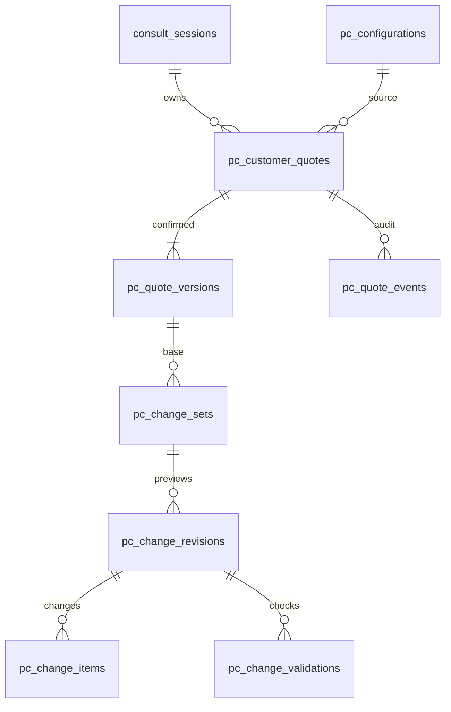

# 부품 변경 견적 계약 — 2026-09-29

상태: 사용자 승인 디자인을 DB 0119에 반영. 변경 API·고객 UI는 후속 구현이며 현재 동작하는 기능으로 안내하지 않는다.

## 1. 고객이 선택한 PC가 출발점

104개 고정 구성 중 고객이 선택한 구성과 판매 항목을 고객 견적에 복사한다. 원본의 ID/revision, 구성·부품 설명·판매 조건·가격 관측일을 보존한다. 원본 카탈로그가 나중에 갱신되어도 당시 제안 내용을 재현한다. 교체 요청은 다른 완제품을 찾는 요청이 아니다. 요청하지 않은 CPU·메인보드·케이스 등의 부품은 유지한다.

`consult_sessions`와 `access_gate.require_session_owner`를 사용한다. 새 회원·세션·접근키 계통을 만들지 않는다. 관리자 검토는 기존 관리자 인증을 사용한다. UUID를 안다는 것만으로 견적 열람/변경을 허용하지 않는다.

## 2. 기존 구조와 역할 분담

| 기존 원천 | 사용 방식 |
|---|---|
| pc_configurations / parts / offers / history | 최초 선택의 원본과 당시 구성/판매가 |
| products / product_specs / product_explanations | 실제 교체 부품·상태·사양·설명·이미지 |
| api.taxonomy | 부품 슬롯/명칭. 동일 정의를 복제하지 않음 |
| compat_rules / api.recommend / api.power_rule | 기존 호환 검사·필요 필드·전력 계산 재사용. 새 BOM의 수량/다중 저장장치를 보존하는 어댑터 필요 |
| api.pricing | 단품 판매가 계산 단일 원천. 완제품 옵션 차액과는 별도 |
| consult_sessions / access_gate | 상담 소유권 및 접근 통제 |
| quote_snapshots / swap_event_logs | 기존 확정 견적/스왑 기록 유지. 새 변경안을 직접 쓰지 않음 |
| api.llm | 요청 해석과 근거 있는 차이 설명. 상품 선정·가격·검사 결과를 임의 생성하지 않음 |

기존 `api.swap._apply_changes`는 즉시 새 quote_snapshot을 생성한다. 적용 전 비교 화면에서 호출하지 않는다. 기존 orders가 최신 snapshot을 읽으므로 새 견적에서 기존 주문 흐름으로 이동할 때만 승인된 확정 버전을 명시적으로 인계한다.

## 3. 테이블 관계

`pc_performance_evidence`는 재사용 가능한 테스트 근거 저장소다. 검사 findings나 비교 응답은 evidence_id와 적용 가능 조건을 함께 전달한다. ID 목록만으로 서로 다른 테스트를 동일 조건 비교로 취급하지 않는다. 초기 테이블은 비어 있으며 예시 FPS·가짜 호환성 통과 기록을 적재하지 않는다.

## 4. BOM과 변경 항목의 JSON 계약

`bom`의 각 행에는 `line_key`, `slot`, `source_code`, `product_code`(단품 연결 없으면 null), `explanation_code`, `quantity`, `units_per_package`, `unit_capacity_gb`(해당 부품), `mount_position`, `pseudo`, `name`, `spec_snapshot`, `spec_hash`, `explanation_hash`를 저장한다. 장착 키트와 패키지 수를 구분한다. 8GB×2 키트 하나를 16GB 두 개로 잘못 계산하지 않는다.

`before_parts` / `after_parts`는 같은 BOM 행 형식을 쓰는 배열이다. 묶음 교체(8GB 두 개 제거→16GB 두 개 장착), 추가 장착(기존 16GB 유지+추가), 제거를 표현한다. 물리 슬롯/메모리 세대·지원 용량·규격·혼용 조건은 실부품 기준으로 검사한다. 기존 설명 FK는 제품 식별자이지 호환성 통과의 근거가 아니다.

변경 집합의 모든 revision은 **기준 확정 견적 대비 누적 차이**다. SSD 요청 후 GPU 요청은 같은 change_set의 다음 revision에 두 변경을 모두 담는다. GPU만 취소하면 다음 revision에 SSD 변경만 남긴다. 동일 부품 재선택은 no-op으로 제거한다. 원본 기준이 아닌 직전 미리보기 가격에서 차액을 반복 더하지 않는다.

DB는 작업별 before/after 배열 존재, 부모 관계, 버전·가격·검증 상태를 강제한다. 개별 JSON 항목의 필수 키/수량/모델 종류, 변경 외 슬롯 유지, BOM 재구성 결과, 해시 생성은 후속 서비스의 엄격한 스키마와 검증 함수가 담당한다. DB 테이블 생성만으로 이 검증이 구현된 것은 아니다.

## 5. 상태 전이와 패널 선택

1. 선택한 PC → 고객 견적 version 1 저장. 미리보기 생성으로 원본이나 현재 견적을 변경하지 않는다.
2. 변경 요청 → draft change_set 생성 → revision 1 BOM/항목 저장 → current_revision 갱신.
3. 추가 요청/개별 취소 → 현재 draft에서 새 revision 작성. 기존 항목/검증 결과는 불변 보존한다.
4. ‘다른 GPU 선택’ 패널 내부 라디오는 임시 선택이다. 닫기·취소는 서버 변경 없이 패널 열기 전 변경안을 유지한다.
5. ‘이 GPU로 변경안 갱신’ → 요청 revision 검사 후 새 draft revision. 이전 SSD 변경 유지.
6. 전체 취소 → change_set cancelled. 현재 확정 견적은 그대로 유지한다.
7. ‘변경 적용’ → 최신 데이터 재검증 → 새 pc_quote_versions 저장 → change_set applied → 현재 견적 포인터를 한 트랜잭션으로 이동한다.

한 견적의 draft는 한 개다. 여러 브라우저 탭이 같은 revision을 수정하면 첫 요청만 반영하고 후속 요청은 409로 최신 변경안을 돌려준다. `expected_revision`으로 충돌을 확인하며, `idempotency_key`로 생성/적용 중복 요청을 식별한다. 별도 수정 요청의 중복 키는 pc_quote_events.payload에 기록하고 API의 견적 행 잠금 안에서 확인한다. 이벤트 기록도 같은 트랜잭션에 포함한다.

## 6. 가격과 예산

`price_basis`는 `method`, `source_ref`, `observed_at`, `expires_at`, `currency`, `tax_included`, `assembly_fee_included`, `line_deltas`, `service_delta`를 갖는다. method는 `catalog_snapshot`, `component_sum`, `merchant_option`, `approved_adjustment` 등 출처를 구분한다. 임의 문자열은 API가 거절한다.

- 신규 단품 합산 구성: 당시 견적에서 제거하는 항목 금액과 새 부품의 현재 유효 판매가를 사용한다. 기존 마진/가격 모듈을 재사용한다.
- 기존 완제품: 패키지 할인과 옵션 정책이 있으므로 옵션 차액 또는 판매처가 확인한 변경 견적이 필요하다. 단품 차이만 알면 estimated이고 최종 적용 불가이다.
- 전체 예상액 = 기준 확정 견적 금액 + 누적 부품 차액 + 근거 있는 서비스 차액. 조립비 3만원이 이미 포함되어 있으면 다시 더하지 않는다.
- 미확인 가격은 null이며 0원으로 치환하지 않는다. pending/estimated/confirmed를 구분한다.
- ‘기존 견적 대비 추가금’과 ‘고객 예산 초과액’을 분리한다. 예산은 본체 기준으로 정규화한 값이다. 전체 예산이면 모니터/OS 등의 배정 금액을 먼저 확인한다.
- 가격 만료·판매 상태 변경·설명/사양 수정은 검사 재실행 사유다. 새로운 가격은 미리보기를 갱신해 고객이 확인해야 하며 최종 적용 시 몰래 바꾸지 않는다.

## 7. 검증과 근거

호환성은 요청한 부품 하나가 아닌 **누적 변경 후 전체 BOM**을 검사한다. GPU 교체에는 CPU/보드 인터페이스, 파워의 용량·전원 단자, 케이스 장착 공간, 다른 장착물의 간섭, 화면 출력 조건 등을 확인한다. 규칙/필드가 없으면 unknown이고 통과 체크를 그리지 않는다. RAM/SSD도 장착 위치·수량을 포함한다.

`pc_change_validations.findings`에는 항목별 결과, 확인한 값, 실패/미확인 이유, 근거 코드·출처, 고객에게 필요한 설명을 담는다. `inputs_hash`는 부품 사양/판매 상태/가격 버전/규칙/고객 조건을 정규화한 값이다. 단순 시간 만료만으로 최신성을 판단하지 않는다.

적용 API는 상담 소유권 확인→고객 견적 `FOR UPDATE`→기준 version/revision 일치→현재 입력 해시/가격 재대조→검사/새 버전/이벤트 저장→적용 상태 변경→commit 순서이다. DB 적용 트리거는 동일 revision/BOM의 유효한 pass 검사와 새 견적 금액/BOM/조건/가격 근거를 확인하고 포인터를 이동한다. 실시간 입력 재조회와 요청자 권한은 API 책임이다.

성능 자료는 실제 모델명·CPU/RAM 등 테스트 구성, 앱/게임 버전, 드라이버, 해상도, 프리셋, RT/업스케일링/프레임 생성, 테스트 장면/방법, 평균·1% low 구분, 단위·표본·출처·측정일을 environment/method/metrics에 보존한다. 서로 다른 조건의 FPS를 단순 뺄셈하지 않는다. 미검토/추정 데이터로 성능 보장을 하지 않는다. 자료 정정·검토 갱신은 supersedes로 새 evidence 행을 만든다.

LLM 설명 입력은 서버가 확정한 before/after, 계산한 차액, 관련 고객 용도, 검사 findings, 적용 가능한 성능 근거뿐이다. 설명 출력은 ‘달라지는 점/차이가 작은 점/추가 확인 사항’을 나눈다. 근거 없는 수치·호환 통과·출고 가능 문장은 거절한다.

## 8. 예정 API와 화면 매핑 — 아직 미구현

| 예정 동작 | 입력/응답 핵심 |
|---|---|
| 고객 견적 생성 | session 소유권, configuration/offer/revision → quote/version |
| 변경 의도 해석 | quote/version, draft/revision, 고객 문장 → 요청 슬롯/작업/조건; LLM 해석 후 서버 검증 |
| 대안 조회 | 현재 누적 BOM, slot, 검색/정렬/필터 → 페이지 단위 후보·검사 상태·전체 예상액 |
| draft 갱신/개별 취소 | expected_revision, 선택한 정확한 부품/수량 → 새 revision |
| 검증 | 전체 BOM의 최신 사양/가격/규칙 → validation + 미확인 항목 |
| 최종 적용 | change_set/revision/validation, idempotency key → 새 확정 version 또는 409 재확인 |
| 기존 구성 유지 | change_set/revision → cancelled |

호환 제품만 필터는 알려진 일부 항목만 통과한 제품을 포함하지 않는다. 미확인 항목이 있는 후보는 별도 상태로 보여주고 ‘장착 가능’이라고 표시하지 않는다. 대안 조회의 각 예상 총액은 이전 SSD 변경 등을 모두 포함한다. 근거가 없는 FPS 행은 숨기거나 조건 확인 안내로 대체한다.

## 9. 구현 검증 기준

- SSD 변경 후 GPU 변경/취소가 SSD 변경안을 보존한다.
- 메모리 변경 시 다른 슬롯은 그대로이며 추가/교체와 키트 수량이 맞다.
- 미리보기 생성/패널 취소가 원본 104개와 현재 확정 견적을 수정하지 않는다.
- 잘못된 수량·차액·다른 견적의 검사·오래된 revision·미확인/만료 검사로 적용할 수 없다.
- 새 가격은 재확인 전 적용되지 않고, 조립비가 중복 가산되지 않는다.
- 동시에 적용하거나 재전송해도 새 확정 버전은 한 개다.
- 고객 A가 고객 B의 견적을 보거나 바꿀 수 없다.
- 출처 없는 FPS/호환성 통과는 생성하지 않는다.

DB 제약 검증은 `tools/check_pc_quote_schema.py`가 신규 DDL과 가상 테스트 행을 하나의 트랜잭션에서 검증한 뒤 모두 rollback한다. 고객용 API/브라우저 검사는 해당 구현 단계에서 수행한다.

## 10. 고객 확정 견적을 제품군으로 축적 — 추가 승인

‘변경 적용’은 해당 고객의 현재 견적을 바꾸는 동작이다. ‘견적 최종 확정’은 제품군 관리에 등록할 동작이다. 둘을 분리한다. 수정하지 않고 기존 추천 PC를 최종 확정한 경우도 등록 대상으로 삼되, 동일 구성과 연결한다.

최종 확정 API는 소유권/현재 버전을 확인하여 pc_quote_confirmations를 기록한다. DB 트리거가 동일 트랜잭션에서 pc_catalog_submissions pending을 생성한다. 재전송은 (quote_id,version) UNIQUE로 중복 확정을 막고 원래 confirmation을 반환한다. 고객 확정 뒤 추가로 수정하면 새 버전이며 과거 확정은 보존한다.

등록 처리기는 pending을 잠그고 다음을 한 트랜잭션으로 수행한다.

1. 확정 버전의 불변 BOM/가격 근거 조회. 원본 구성과 당시 부품 모델·수량을 유지한다.
2. 공용 BOM fingerprint 함수로 모델·수량·키트/장착 정보를 정규화한다. UUID/행 순서/고객 이름/가격은 구성 동일성에 포함하지 않는다. `pc_configuration_copy`와 기존 카탈로그 생성 도구의 fingerprint 규칙을 먼저 대조해 하나로 통일한다. 기존 해시가 수량·패키지를 표현하지 못하면 사전 이관이 필요하며, 서로 다른 구성의 오연결을 피한다.
3. 같은 BOM의 pc_configurations가 있으면 기존 제품군과 연결하고 반복 확정 이력만 추가한다. 단종/퇴역 제품군이면 자동 판매 재개하지 않고 review_required로 보낸다.
4. 없으면 신규 관리 ID로 pc_configurations/parts/offer를 작성하고 기본 설명을 초안 생성한다. 고객 정보와 상담 원문은 제품군에 넣지 않는다. 정규 제품군 관리 화면에 ‘고객 확정 견적에서 추가’ 출처로 표시한다.
5. configuration_id를 submissions에 연결한다. 동일 fingerprint 경합은 UNIQUE 충돌 후 기존 구성 재조회로 처리한다. 가격 조건이 다른 경우 구성은 재사용하고 offer/가격 이력은 분리한다.
6. 자료 누락/모델 불명확 등은 review_required에 이유를 남겨 관리자 목록에서 후속 보완한다. 등록 대기를 사라지게 하거나 가짜 사양을 채우지 않는다.

공용 제품군 등록과 고객 추천 공개는 별개 상태다. 사용자 의도대로 관리 목록은 늘어나되, 고객 확정만으로 재고 확보·실조립·FPS 실측을 승인하지 않는다. 이 단계는 큐/관계/이력 DB까지 반영하며 실제 고객 확정 버튼과 등록 처리기 연결은 다음 구현 범위다.
