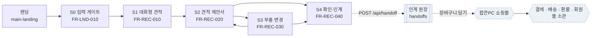
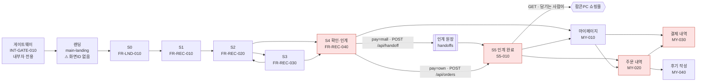
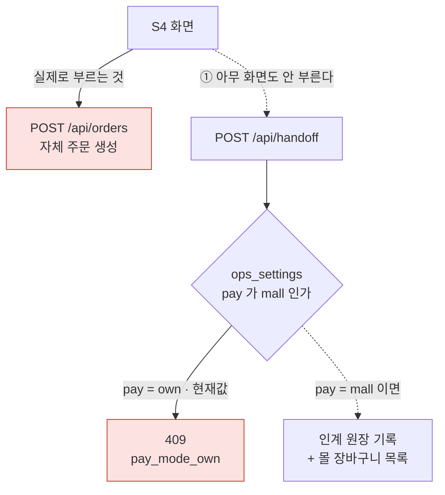
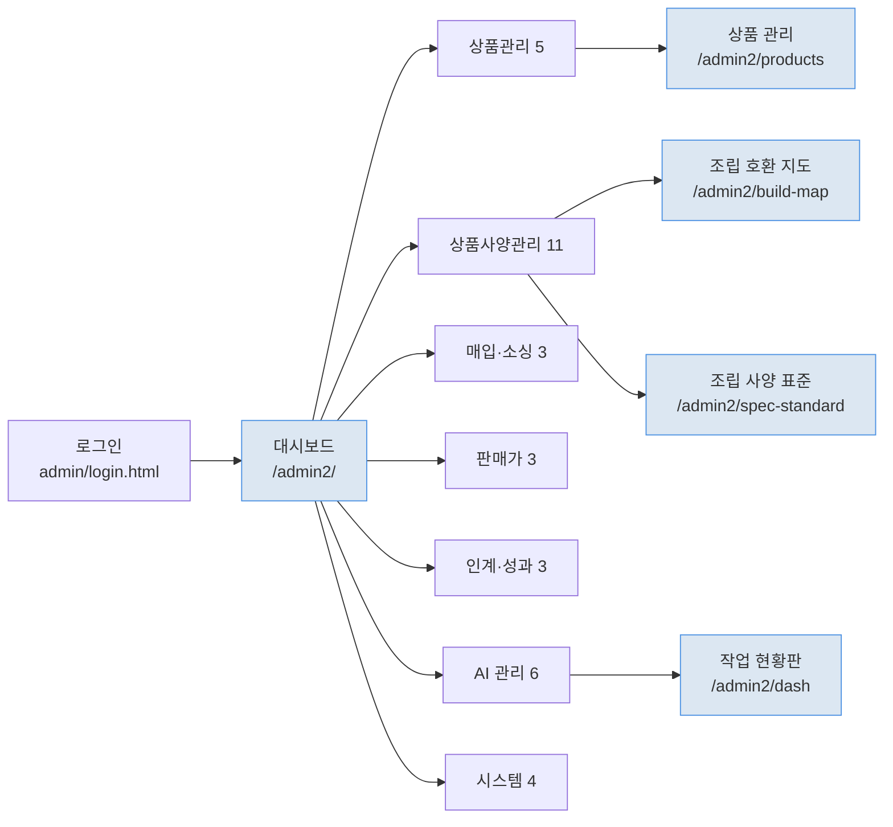
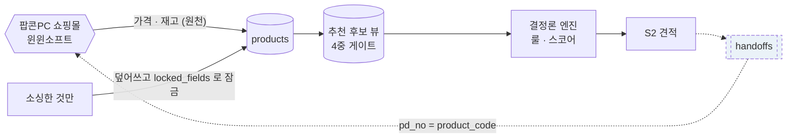

# 화면 흐름 정본 — 프로세스 흐름도

**작성 2026-08-12 · 전부 파일과 DB 에서 실측한 값이다.**
그린 것이 아니라 **잰 것**이다 — 링크·JS 이동·API 호출·스위치 값을 뽑아 그렸다.

> VSCode 미리보기(`Ctrl+Shift+V`) 또는 GitHub 에서 도형으로 보인다.
>
> **`screen-flow.png` 는 이 문서를 통째로 렌더한 사본**이다(1920×6536 · mermaid 를 못 그리는
> 곳에서 보려고 둔다). **정본은 이 `.md` 파일이고 PNG 는 스냅숏이다** — 아래를 고치면
> PNG 도 다시 내보내야 한다. 안 그러면 같은 것을 두 벌 두는 병에 그대로 걸린다.

---

## 범례

    ▢ 실선   지금 실제로 동작하는 길 (마크업·JS 에 있다)
    ▢ 점선   확정됐으나 **아직 이어지지 않은 길**
    ⬡ 굵은선 우리 밖 — 팝콘PC 쇼핑몰
    ▣ 원장   되돌릴 수 없는 기록

---

## ① 확정 흐름 — 팝콘AI 는 유입 채널이다 (2026-08-11 확정)

고객을 받아 **호환성을 판정하고 견적까지** 만든 뒤 **쇼핑몰로 넘긴다.**
결제·배송·환불·회원관리는 그쪽 일이다.

**우리가 하지 않는 것이 이 그림의 절반이다.** 인계 뒤로는 원장도 우리 것이 아니다.

---

## ② 지금 화면이 하는 것 — 실측

`mockups/mvp1/*.html` 의 `href` · `location.href` · `fetch` 를 전부 뽑았다.

**붉은 것이 자체 판매 경로다.** S4 가 `/api/orders` 를 불러 **우리 원장에 주문을 만들고**,
S5·주문 내역·결제 내역이 그 뒤를 받는다. 확정 범위에서는 몰이 할 일이다.

---

## ③ 확정과 실제의 차이 — **인계로 가는 길이 두 군데서 막혀 있다**

| # | 막는 것 | 실측 | 상태 |
|---|---|---|---|
| ① | 화면이 인계를 부르지 않았다 | `mockups/` 전체에서 `handoff` 0건 | **해소(2026-08-12)** — S4·S5 재작업 |
| ② | 운영 스위치가 자체 모드 | `GET /api/ops` → `pay: own` | **`mall` 로 전환** · 되돌림 `6110` |

**해소 실측(2026-08-12)** — 견적 → S4 「쇼핑몰로 넘기기」 → `HO-1003`:

    원장       handoffs +1 · handoff_items 9줄 (부품 8 + 조립비)
    가격 재확인 price_checked=true · 몰 가격과 다른 부품 **5개**
               견적 1,529,700 -> 몰 1,542,200 (+12,500)
               한 부품은 853,200 -> 904,700 (+51,500)
    화면       S5 가 인계번호·예상금액·담을 목록 9개·변동 5개를 그대로 표시

**우리가 장바구니를 대신 담지 않는다**(CANON ⑥ 실서비스는 GET 만). 인계는
「원장에 남기고 · 담을 목록을 보여주고 · 몰로 보낸다」까지다. 자동 담기는 윈윈소프트 API 이후다.

`POST /api/handoff` 를 직접 불러 **409 를 실측**했다(쓰기 전 가드에서 막힌다).
인계 원장에는 제작 때 검증으로 만든 **2건**(`handoff_items` 18행)이 있다 —
개발 서버라 잔재를 두어도 되지만(I-01), 운영은 **원장을 비우고** 시작한다.

### 운영 스위치 5개 — 확정 범위와 맞는 것은 2개뿐

| 스위치 | 현재 | 확정 범위 | 판정 |
|---|---|---|---|
| `ship` 배송 | `mall` | 몰 | 맞음 |
| `refund` 환불 | `mall` | 몰 | 맞음 |
| `pay` 결제 | `mall` | 몰 | 맞음 (2026-08-12 전환 · 되돌림 `6110`) |
| `settle` 정산 | `mall` | — | `pay` 를 따라 서버가 자동 보정했다 |
| `member` 회원 | **`own`** | 몰 | **어긋남** — 몰 회원 ID 공유는 윈윈소프트 API 대기 |

**스위치를 임의로 바꾸지 않는다** — 되돌릴 수 없는 일에 걸린 설정이고, 바꾸는 순간
고객 화면의 동작이 달라진다.

---

## ④ 관리자 흐름 — LNB 8그룹 36항목 (정본 `api/admin_nav.py`)

    재구축 완료(파란 것)  5  — 링크가 붙는 것은 이것뿐
    기존 화면만 있음      22 — /admin/*.html 로 직접 열 수 있으나 메뉴에 링크 없음
    신설 예정             9

**「인계·성과」 3항목이 통째로 신설 예정이다** — 쇼핑몰 동기화 · 인계 기록 · 유입 성과.
우리가 팔지 않으므로 재야 할 것은 매출이 아니라 **전환**인데, 그 축이 원래 IA 에 없었다.

---

## ⑤ 값이 흐르는 길 — 몰과 우리

- **몰 상품코드 `pd_no` == 우리 `products.product_code`** — 실측 확인, 매핑표가 필요 없다.
- 가격 원천은 몰이고, **소싱한 경우만** 우리 값이 이긴다.
- 4중 게이트: `no_specs` → `need_review` → `not_candidate` → `no_price` → `oos`.
  **NULL 은 통과하지 못한다** — 사양이 비면 조용히 후보에서 빠진다.

---

## ⑥ 이 문서를 갱신하는 규약

**화면을 더하거나 이동을 바꾸면 여기부터 고친다.** 코드가 먼저 바뀌고 문서가 남으면
다음 세션이 틀린 그림을 사실로 읽는다 — `HANDOFF.md` 가 20커밋 뒤처진 채 **범위를
정반대로** 말하고 있던 전례가 그것이다.

    ① 그림은 재서 그린다      href · location.href · fetch 를 뽑아 대조한다
    ② 「아직 없는 길」은 점선   지운 것과 안 이은 것은 다르다
    ③ 숫자는 정본에서          LNB 수는 api/admin_nav.counts() · 스위치는 GET /api/ops
    ④ 판단이 갈리면 비운다      settle 처럼. 결함으로 적으면 다음 사람이 안 묻고 정한다

### 다음에 할 일 (이 그림이 가리키는 것)

1. ~~**S4 재작업**~~ — 2026-08-12 완료. 남은 것: **가격 변동이 큰 것을 화면이 먼저 막을지**.
   실측에서 한 부품이 +51,500원이었다. 지금은 알리고 넘긴다 — 막지는 않는다. **미정.**
2. **MY-020 · MY-030 처리 결정** — 주문 내역·결제 내역이 몰 소관이면 우리 화면이 아니다.
   지우나, 몰로 보내는 링크로 바꾸나. **미정.**
3. **`main-landing` 에 `data-screen-id` 부여** — 지금 없다(마크업 계약 위반).
4. **인계 성과 화면** — 원장은 쌓이는데 볼 화면이 없다(「인계·성과」 3항목 전부 신설 예정).
5. **시험 잔재** — `HO-1003` 은 이 검증으로 만든 것이다. 개발 서버라 두어도 되지만(I-01)
   전환율을 셀 때 빼야 한다. 운영은 원장을 비우고 시작한다.
