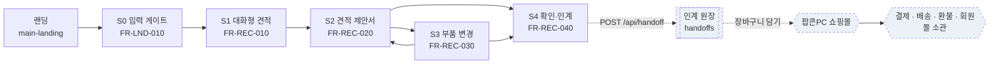
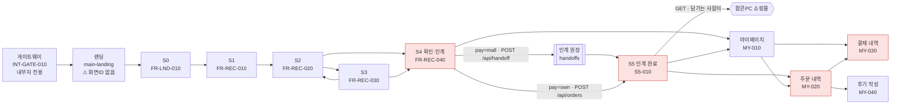
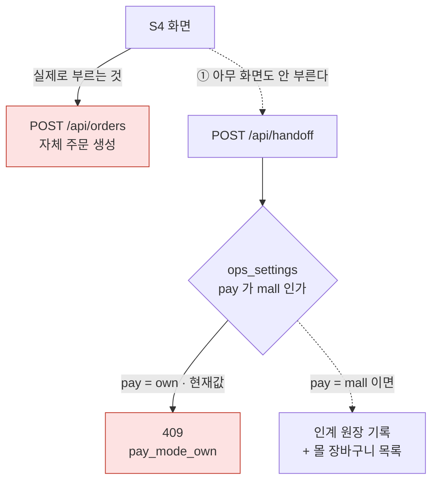
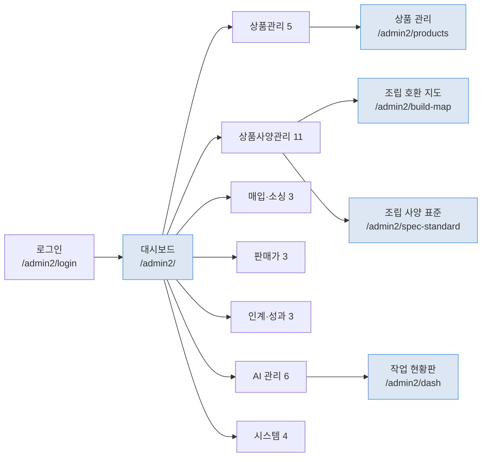
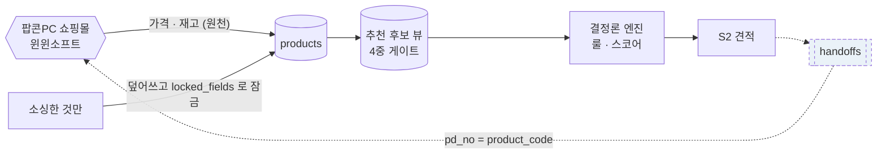

# 화면 흐름 정본 — 프로세스 흐름도

## 2026-09-29 조립PC 제품군 관리

상품관리 → 조립PC 제품군(`/admin2/pc-configurations`) → 목록 검색·출처/정보검토/공개상태 필터 → 행 선택 → 오른쪽 요약 → 「전체 구성·부품 보기」 상세 대화상자.
현재 검색 결과는 엑셀로 내려받는다. 추천 테스트는 별도 상담 검토 화면으로 이동한다. 신규 구성 등록과 공개 승인 변경은 이번 조회 화면에서 실행하지 않는다. 기준 가격은 저장 당시 가격이며 호환성 검증·고객 공개 승인을 뜻하지 않는다.

**작성 2026-08-12 · 전부 파일과 DB 에서 실측한 값이다.**
그린 것이 아니라 **잰 것**이다 — 링크·JS 이동·API 호출·스위치 값을 뽑아 그렸다.

> VSCode 미리보기(`Ctrl+Shift+V`) 또는 GitHub 에서 도형으로 보인다.
>
> **`screen-flow.png` 는 이 문서를 통째로 렌더한 사본**이다(1920×6536 · mermaid 를 못 그리는
> 곳에서 보려고 둔다). **정본은 이 `.md` 파일이고 PNG 는 스냅숏이다** — 아래를 고치면
> PNG 도 다시 내보내야 한다. 안 그러면 같은 것을 두 벌 두는 병에 그대로 걸린다.

---

## 범례

    ▢ 실선   지금 실제로 동작하는 길 (마크업·JS 에 있다)
    ▢ 점선   확정됐으나 **아직 이어지지 않은 길**
    ⬡ 굵은선 우리 밖 — 팝콘PC 쇼핑몰
    ▣ 원장   되돌릴 수 없는 기록

---

## ① 확정 흐름 — 팝콘AI 는 유입 채널이다 (2026-08-11 확정)

고객을 받아 **호환성을 판정하고 견적까지** 만든 뒤 **쇼핑몰로 넘긴다.**
결제·배송·환불·회원관리는 그쪽 일이다.

```mermaid
flowchart LR
  L["랜딩<br/>main-landing"] --> S0["S0 입력 게이트<br/>FR-LND-010"]
  S0 --> S1["S1 대화형 견적<br/>FR-REC-010"]
  S1 --> S2["S2 견적 제안서<br/>FR-REC-020"]
  S2 --> S3["S3 부품 변경<br/>FR-REC-030"]
  S3 --> S2
  S2 --> S4["S4 확인·인계<br/>FR-REC-040"]
  S3 --> S4
  S4 -.->|"POST /api/handoff"| HO[["인계 원장<br/>handoffs"]]
  HO -.->|"장바구니 담기"| MALL{{"팝콘PC 쇼핑몰"}}
  MALL --> PAY{{"결제 · 배송 · 환불 · 회원<br/>몰 소관"}}

  classDef todo fill:#eaf2f8,stroke-dasharray:4
  class HO,MALL,PAY todo
```

**우리가 하지 않는 것이 이 그림의 절반이다.** 인계 뒤로는 원장도 우리 것이 아니다.

---

## ② 지금 화면이 하는 것 — 실측

`mockups/mvp1/*.html` 의 `href` · `location.href` · `fetch` 를 전부 뽑았다.

```mermaid
flowchart LR
  GATE["게이트웨이<br/>INT-GATE-010<br/>내부자 전용"] --> L
  L["랜딩<br/>main-landing<br/>⚠ 화면ID 없음"] --> S0["S0<br/>FR-LND-010"]
  S0 --> S1["S1<br/>FR-REC-010"]
  S1 --> S2["S2<br/>FR-REC-020"]
  S2 --> S3["S3<br/>FR-REC-030"]
  S3 --> S2
  S2 --> S4["S4 확인·인계<br/>FR-REC-040"]
  S3 --> S4
  S4 -->|"pay=mall · POST /api/handoff"| HO[["인계 원장<br/>handoffs"]]
  HO --> S5["S5 인계 완료<br/>S5-010"]
  S5 -->|"GET · 담기는 사람이"| MALL{{"팝콘PC 쇼핑몰"}}
  S4 -->|"pay=own · POST /api/orders"| S5
  S4 --> MY1
  S5 --> MY1["마이페이지<br/>MY-010"]
  S5 --> MY2["주문 내역<br/>MY-020"]
  MY1 --> MY2
  MY1 --> MY3["결제 내역<br/>MY-030"]
  MY2 --> MY3
  MY2 --> MY4["후기 작성<br/>MY-040"]

  classDef own fill:#fde2e2,stroke:#c0392b
  class S4,S5,MY2,MY3 own
```

**붉은 것이 자체 판매 경로다.** S4 가 `/api/orders` 를 불러 **우리 원장에 주문을 만들고**,
S5·주문 내역·결제 내역이 그 뒤를 받는다. 확정 범위에서는 몰이 할 일이다.

⚠ **정정(2026-08-19, 길잡이 「견적 AI 재검토」)** — 위 ①·② 다이어그램의 `S1 --> S2`
화살표 하나는 **S1 내부의 갈래를 감춘다.** S1 은 진입 시점에 **네 모드**(guided·chat·
expert·talk, `CLAUDE.md` §화면 "4모드")로 갈리는데, 이번에 처음 실측한 것은 **그중
셋(guided·chat·talk)만 S2 로 이어지고 expert 는 이어지지 않는다**는 사실이다 —
expert 는 `fetch` **0건**, `consult_sessions` 에 `mode='expert'` 행이 4주간 **0건**
(근거·확인법은 `docs/decisions/decision-log.md` **A-71**).
**이 정정은 S1→S2 구간에만 해당한다** — 이 문서의 나머지 다이어그램(①·③~⑥)은
이번 재검토의 측정 범위 밖이라 **손대지 않았다.** 문서 전체 재측정은 여전히 별도
물결로 남아 있다(`HANDOFF.md` §0 pathfinder 「첫 임무 후보」). **「그린 것이 아니라
잰 것」** 원칙에 따라 재지 않은 부분을 지금 고치지 않는다 — A-71 1단계(서버 실판정 +
S2 연결)가 실제로 지어지면 이 정정을 다시 실선 다이어그램으로 흡수한다.

---

## ③ 확정과 실제의 차이 — **인계로 가는 길이 두 군데서 막혀 있다**

```mermaid
flowchart TB
  A["S4 화면"] -->|"실제로 부르는 것"| B["POST /api/orders<br/>자체 주문 생성"]
  A -.->|"① 아무 화면도 안 부른다"| C["POST /api/handoff"]
  C --> D{"ops_settings<br/>pay 가 mall 인가"}
  D -->|"pay = own · 현재값"| E["409<br/>pay_mode_own"]
  D -.->|"pay = mall 이면"| F["인계 원장 기록<br/>+ 몰 장바구니 목록"]

  classDef blocked fill:#fde2e2,stroke:#c0392b
  class B,E blocked
```

| # | 막는 것 | 실측 | 상태 |
|---|---|---|---|
| ① | 화면이 인계를 부르지 않았다 | `mockups/` 전체에서 `handoff` 0건 | **해소(2026-08-12)** — S4·S5 재작업 |
| ② | 운영 스위치가 자체 모드 | `GET /api/ops` → `pay: own` | **`mall` 로 전환** · 되돌림 `6110` |

**해소 실측(2026-08-12)** — 견적 → S4 「쇼핑몰로 넘기기」 → `HO-1003`:

    원장       handoffs +1 · handoff_items 9줄 (부품 8 + 조립비)
    가격 재확인 price_checked=true · 몰 가격과 다른 부품 **5개**
               견적 1,529,700 -> 몰 1,542,200 (+12,500)
               한 부품은 853,200 -> 904,700 (+51,500)
    화면       S5 가 인계번호·예상금액·담을 목록 9개·변동 5개를 그대로 표시

**우리가 장바구니를 대신 담지 않는다**(CANON ⑥ 실서비스는 GET 만). 인계는
「원장에 남기고 · 담을 목록을 보여주고 · 몰로 보낸다」까지다. 자동 담기는 윈윈소프트 API 이후다.

`POST /api/handoff` 를 직접 불러 **409 를 실측**했다(쓰기 전 가드에서 막힌다).
인계 원장에는 제작 때 검증으로 만든 **2건**(`handoff_items` 18행)이 있다 —
개발 서버라 잔재를 두어도 되지만(I-01), 운영은 **원장을 비우고** 시작한다.

### 운영 스위치 5개 — 확정 범위와 맞는 것은 2개뿐

| 스위치 | 현재 | 확정 범위 | 판정 |
|---|---|---|---|
| `ship` 배송 | `mall` | 몰 | 맞음 |
| `refund` 환불 | `mall` | 몰 | 맞음 |
| `pay` 결제 | `mall` | 몰 | 맞음 (2026-08-12 전환 · 되돌림 `6110`) |
| `settle` 정산 | `mall` | — | `pay` 를 따라 서버가 자동 보정했다 |
| `member` 회원 | **`own`** | 몰 | **어긋남** — 몰 회원 ID 공유는 윈윈소프트 API 대기 |

**스위치를 임의로 바꾸지 않는다** — 되돌릴 수 없는 일에 걸린 설정이고, 바꾸는 순간
고객 화면의 동작이 달라진다.

---

## ④ 관리자 흐름 — LNB 8그룹 36항목 (정본 `api/admin_nav.py`)

```mermaid
flowchart LR
  LOGIN["로그인<br/>/admin2/login"] --> HOME["대시보드<br/>/admin2/"]

  HOME --> G1["상품관리 5"]
  HOME --> G2["상품사양관리 11"]
  HOME --> G3["매입·소싱 3"]
  HOME --> G4["판매가 3"]
  HOME --> G5["인계·성과 3"]
  HOME --> G6["AI 관리 6"]
  HOME --> G7["시스템 4"]

  G1 --> P1["상품 관리<br/>/admin2/products"]
  G2 --> P2["조립 호환 지도<br/>/admin2/build-map"]
  G2 --> P3["조립 사양 표준<br/>/admin2/spec-standard"]
  G6 --> P4["작업 현황판<br/>/admin2/dash"]

  classDef done fill:#dce7f2,stroke:#4a90e2
  class HOME,P1,P2,P3,P4 done
```

    재구축 완료(파란 것)  5  — 링크가 붙는 것은 이것뿐
    기존 화면만 있음      22 — /admin/*.html 로 직접 열 수 있으나 메뉴에 링크 없음
    신설 예정             9

**「인계·성과」 3항목이 통째로 신설 예정이다** — 쇼핑몰 동기화 · 인계 기록 · 유입 성과.
우리가 팔지 않으므로 재야 할 것은 매출이 아니라 **전환**인데, 그 축이 원래 IA 에 없었다.

---

## ⑤ 값이 흐르는 길 — 몰과 우리

```mermaid
flowchart LR
  MALL{{"팝콘PC 쇼핑몰<br/>윈윈소프트"}} -->|"가격 · 재고 (원천)"| P[("products")]
  SRC["소싱한 것만"] -->|"덮어쓰고 locked_fields 로 잠금"| P
  P --> V[("추천 후보 뷰<br/>4중 게이트")]
  V --> ENG["결정론 엔진<br/>룰 · 스코어"]
  ENG --> S2["S2 견적"]
  S2 -.-> HO[["handoffs"]]
  HO -.->|"pd_no = product_code"| MALL

  classDef todo fill:#eaf2f8,stroke-dasharray:4
  class HO todo
```

- **몰 상품코드 `pd_no` == 우리 `products.product_code`** — 실측 확인, 매핑표가 필요 없다.
- 가격 원천은 몰이고, **소싱한 경우만** 우리 값이 이긴다.
- 4중 게이트: `no_specs` → `need_review` → `not_candidate` → `no_price` → `oos`.
  **NULL 은 통과하지 못한다** — 사양이 비면 조용히 후보에서 빠진다.

---

## ⑥ 이 문서를 갱신하는 규약

**화면을 더하거나 이동을 바꾸면 여기부터 고친다.** 코드가 먼저 바뀌고 문서가 남으면
다음 세션이 틀린 그림을 사실로 읽는다 — `HANDOFF.md` 가 20커밋 뒤처진 채 **범위를
정반대로** 말하고 있던 전례가 그것이다.

    ① 그림은 재서 그린다      href · location.href · fetch 를 뽑아 대조한다
    ② 「아직 없는 길」은 점선   지운 것과 안 이은 것은 다르다
    ③ 숫자는 정본에서          LNB 수는 api/admin_nav.counts() · 스위치는 GET /api/ops
    ④ 판단이 갈리면 비운다      settle 처럼. 결함으로 적으면 다음 사람이 안 묻고 정한다

### 다음에 할 일 (이 그림이 가리키는 것)

1. ~~**S4 재작업**~~ — 2026-08-12 완료. 남은 것: **가격 변동이 큰 것을 화면이 먼저 막을지**.
   실측에서 한 부품이 +51,500원이었다. 지금은 알리고 넘긴다 — 막지는 않는다. **미정.**
2. **MY-020 · MY-030 처리 결정** — 주문 내역·결제 내역이 몰 소관이면 우리 화면이 아니다.
   지우나, 몰로 보내는 링크로 바꾸나. **미정.**
3. **`main-landing` 에 `data-screen-id` 부여** — 지금 없다(마크업 계약 위반).
4. **인계 성과 화면** — 원장은 쌓이는데 볼 화면이 없다(「인계·성과」 3항목 전부 신설 예정).
5. **시험 잔재** — `HO-1003` 은 이 검증으로 만든 것이다. 개발 서버라 두어도 되지만(I-01)
   전환율을 셀 때 빼야 한다. 운영은 원장을 비우고 시작한다.

## 2026-09-28 부품 설명 검토 흐름 추가

상품관리 → **부품 설명 관리**(`/admin2/part-explanations`, ADM-PRD-030) → 상품명·코드·종류 검색 → 상세 펼침(등록 이미지 / 사양·근거 / 역할·확인사항 / FAQ). 기존 admin2 인증·메뉴·셸을 재사용한다.

- 상세 렌더러: `mockups/shared/part-explanations.js` + `.css`. 검토 화면과 고객 상세 연결 시 같은 렌더러를 쓴다.
- 이번 구현은 초안 조회이며, 수정·승인 워크플로와 고객 추천 카드 연결은 후속 단계다.
- 공개 API는 검수 승인·판매중·상품 연결·원문 일치·충돌 없음이 모두 성립해야 읽을 수 있다. 단순 가격 변경은 설명을 무효화하지 않으며 실제 상품명·사양 변경은 차단한다. 카탈로그 적재 과정의 앞뒤 공백 제거만 동일하게 취급한다.
- 질문 버튼은 현재 저장된 FAQ를 펼친다. 자유 질의 상담 전송 기능으로 표시하지 않는다.
- 전체 PC 선택 이유는 부품 자체 설명과 분리한다. 알뜰 구성 / 추천 구성 두 제안의 이름만으로 성능을 보증하지 않는다.

## 2026-09-28 구성 기반 LLM 상담 검토

상품관리 → 조립PC 상담 검토(/admin2/configuration-consultation, ADM-PRD-040) → 자유 입력 → LLM 조건 확인(후속 질문 최대 2개) → 조건 기반 DB 후보 비교 → 구성별 부품·근거 확인. API 오류/시간 초과는 입력을 보존하고 재시도할 수 있게 한다. 이전 턴 응답이 새 상담을 덮어쓰지 않도록 요청 번호를 확인한다. 기존 고객 mvp2의 공개 추천 경로는 유지한다.

### 2026-09-29 부품 변경과 고객 확정 제품군 등록

고객 선택 PC → 부품 변경 미리보기(다른 슬롯·이전 요청 유지) → 다른 부품 선택 패널(내부 임시 선택) → 변경안 갱신 → 전체 검증/차액 확인 → 변경 적용(고객 견적 새 버전) → 견적 최종 확정 → 제품군 등록 대기 → 동일 BOM 연결 또는 신규 관리 제품군 추가. 화면 기준은 사용자가 제공한 변경 전후 비교 및 오른쪽 GPU 비교 패널이다. DB 0119 설계 반영이며 화면/API 연결은 후속이다. 계약: `pc-component-change-contract.md`.

### 2026-09-29 관리자 부품 구성 편집 (1+2+3 결합안)

조립PC 제품군 → 전체 구성·부품 보기 → 부품 구성 변경(구성표) → 변경 버튼 → 오른쪽 후보 검색·현재/선택 비교 → 이 부품 선택(로컬 변경안) → 변경 내용 확인(서버 차액 계산) → 기존 제품군 수정 / 새 제품군으로 저장 → 검토 대기 제품군. 다른 부품의 변경안은 유지한다. 저장 전 단계에서는 DB를 바꾸지 않는다. 상품 설명 편집과 부품 편집의 미저장 변경이 섞이지 않도록 탭·고객 미리보기를 보호한다.

이 흐름은 관리자 편집이다. 고객 견적 변경·최종 확정 경로(0119)와 공개 승인 UI는 아직 별도 후속이다.

### 2026-09-30 관리자 구성 검토와 추천 반영

전체 구성 보기 → 검토 기록 → 현재 DB 호환 규칙 대조 → 보완 항목 해결 → 장착·연결·수량/설명/가격 근거 기록 → 검토 내용 저장 또는 검토 완료·추천 반영. 작성 중 닫기는 입력 취소 여부를 확인한다. 규칙상 불일치, 설명 원문 불일치, 판매중이 아닌 부품 등이 있으면 승인할 수 없다. 사양 누락은 통과로 표시하지 않고 별도 수동 확인 근거를 요구한다.

승인은 관리자 조립PC 상담 검토 후보에 반영한다. 승인 후 구성·설명·가격·부품 사양·호환 규칙이 바뀌면 재검토 상태로 표시하고 후보에서 제외한다. 추천 제외는 사유를 남기며 이력을 보존한다. 기존 고객 mvp2 공개 경로와 실제 출고 승인은 별개다.

### 2026-09-30 추천 판정 / 고객별 조립 분리

위 검토 흐름에서 물리적 조립 확인을 추천 승인 필수 체크에서 분리했다. 제품군 목록 → 전체 구성 → 검토 기록 → 추천 규격 대조 / 조립 확인 예정 → 추천 설명·가격 근거 → 추천 검토 처리. 핵심 규격 미확인은 메모로 승인할 수 없고 근거 사양을 먼저 보완한다. 조건부 후보는 확인 예정 항목을 계속 표시하며 고객 필수 조건과 다시 대조한다.

같은 검토 화면의 고객별 기록 → 등록된 견적 선택 → 조립 이슈 → 준비된 변경안 비교 → 전화 동의/거절/미응답 기록 → 유효한 검증과 동의 확인 → 견적 새 버전 적용 → 이슈 해결 → 재검수. 현재 실제 견적0건은 빈 상태로 표시한다. 견적 신규 등록·변경안/검증 생성 상위 경로는 아직 미연결이다. 계약과 제한은 `recommendation-assembly-workflow-20260930.md`.
